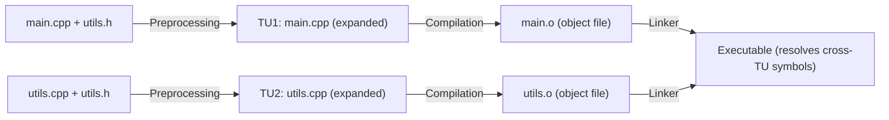
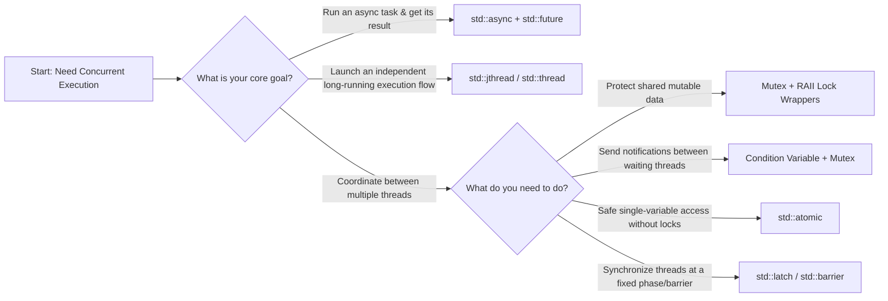

## 1 Class Behavior

There are several keywords to control class behavior and improve safety, performance, and code clarity.

### 1.1 `final`

The `final` keyword prevents inheritance from a class or overriding of virtual functions, enabling important optimizations and API design decisions.

#### final Classes

```c++
class Base {
public:
    virtual void foo() { std::cout << "Base::foo\n"; }
    virtual ~Base() = default;
};

class FinalClass final : public Base {  // Cannot be inherited from
public:
    void foo() override { std::cout << "FinalClass::foo\n"; }
};

// class SubClass : public FinalClass {};  // Error: FinalClass is final

// Usage example
void processBase(const Base& obj) {
    obj.foo();  // May require virtual dispatch
}

void processFinal(const FinalClass& obj) {
    obj.foo();  // Can be inlined - no virtual dispatch needed
}
```

#### final Member Functions

```c++
class Base {
public:
    virtual void foo() { std::cout << "Base::foo\n"; }
    virtual void bar() { std::cout << "Base::bar\n"; }
    virtual ~Base() = default;
};

class Derived : public Base {
public:
    void foo() final override { std::cout << "Derived::foo\n"; }  // Cannot be overridden further
    void bar() override { std::cout << "Derived::bar\n"; }
};

class FurtherDerived : public Derived {
public:
    // void foo() override;  // Error: foo is final in Derived
    void bar() override { std::cout << "FurtherDerived::bar\n"; }  // OK
};
```

#### API Design with final

```c++
// Design pattern: Template Method with final hook
class GameCharacter {
public:
    // Template method - final to prevent modification of algorithm
    void performAction() final {
        prepare();
        execute();
        cleanup();
    }
    
    virtual ~GameCharacter() = default;
    
protected:
    virtual void prepare() = 0;
    virtual void execute() = 0;
    virtual void cleanup() = 0;
};

class Warrior : public GameCharacter {
protected:
    void prepare() override { std::cout << "Warrior draws sword\n"; }
    void execute() override { std::cout << "Warrior attacks\n"; }
    void cleanup() override { std::cout << "Warrior sheathes sword\n"; }
};

class Mage final : public GameCharacter {  // Mage behavior is complete
protected:
    void prepare() override { std::cout << "Mage chants spell\n"; }
    void execute() override { std::cout << "Mage casts fireball\n"; }
    void cleanup() override { std::cout << "Mage lowers hands\n"; }
};
```

### 1.2 `default`

The `default` keyword explicitly requests the compiler to generate default implementations for special member functions, providing better performance and clearer intent than user-defined equivalents.

#### When to Use default

```c++
// Case 1: When other constructors are defined
class Resource {
private:
    std::unique_ptr<int> data;
    std::string name;
public:
    Resource(const std::string& n) : name(n), data(std::make_unique<int>(0)) {}
    
    // Still need copy/move operations for container compatibility
    Resource(const Resource&) = default;
    Resource& operator=(const Resource&) = default;
    Resource(Resource&&) = default;
    Resource& operator=(Resource&&) = default;
};

// Case 2: When you want to ensure trivial operations
class Trivial {
public:
    int x, y;
    double z;
    
    // Explicitly default to ensure triviality
    Trivial() = default;
    Trivial(const Trivial&) = default;
    Trivial& operator=(const Trivial&) = default;
    ~Trivial() = default;
};

static_assert(std::is_trivial_v<Trivial>, "Trivial should be trivial");
```

### 1.3 `delete`

The `delete` keyword explicitly prevents the use of functions or operators, enabling fine-grained control over class interfaces and preventing dangerous operations.

#### Preventing Copy Operations

```c++
class NonCopyable {
public:
    NonCopyable() = default;
    
    // Prevent copying
    NonCopyable(const NonCopyable&) = delete;
    NonCopyable& operator=(const NonCopyable&) = delete;
    
    // Allow moving
    NonCopyable(NonCopyable&&) = default;
    NonCopyable& operator=(NonCopyable&&) = default;
    
    ~NonCopyable() = default;
};

// Usage
void demonstrateNonCopyable() {
    NonCopyable obj1;
    // NonCopyable obj2 = obj1;  // Error: copy constructor deleted
    // obj1 = obj1;              // Error: copy assignment deleted
    
    NonCopyable obj3 = std::move(obj1);  // OK: move constructor available
}
```

#### Preventing Dangerous Conversions

```c++
class SafeInteger {
private:
    int value;
public:
    SafeInteger(int v) : value(v) {}
    
    // Allow int conversion
    SafeInteger& operator=(int v) { value = v; return *this; }
    
    // Prevent dangerous floating-point conversions
    SafeInteger& operator=(double) = delete;
    SafeInteger& operator=(float) = delete;
    SafeInteger& operator=(long double) = delete;
    
    // Prevent pointer conversions
    SafeInteger& operator=(void*) = delete;
    SafeInteger& operator=(const char*) = delete;
};

void demonstrateSafeConversions() {
    SafeInteger si(42);
    si = 100;        // OK: int assignment
    // si = 3.14;     // Error: double assignment deleted
    // si = "test";   // Error: const char* assignment deleted
}
```

#### Template Specialization with delete

```c++
template<typename T>
class Container {
private:
    std::vector<T> data;
public:
    void add(const T& item) { data.push_back(item); }
    
    // Delete problematic specializations
    template<typename U = T>
    typename std::enable_if<std::is_pointer<U>::value>::type
    add(U item) = delete;  // Prevent pointer addition
};

// More modern approach with concepts (C++20)
template<typename T>
class ModernContainer {
public:
    void add(const T& item) { /* implementation */ }
    
    // Delete pointer types
    void add(T* item) = delete;
};
```

#### Preventing Array Operations

```c++
class NoArrays {
public:
    NoArrays() = default;
    
    // Prevent array operations that don't make sense
    void operator[](int) = delete;
    void operator[](size_t) = delete;
    void operator[](long) = delete;
};

void demonstrateNoArrays() {
    NoArrays obj;
    // obj[0];  // Error: operator[] deleted
}
```

### 1.4 `explicit`

The `explicit` keyword prevents implicit conversions, making code safer and more predictable by requiring explicit type conversions.

#### Explicit Constructors

```c++
class String {
private:
    std::string data;
public:
    // Single-argument constructor should be explicit
    explicit String(const char* str) : data(str) {}
    
    // Multi-argument constructors don't need explicit (can't be implicit)
    String(const char* str, size_t len) : data(str, len) {}
    
    // Converting constructor (sometimes useful but dangerous)
    String(int size) : data(size, ' ') {}  // Creates string of spaces
};

void demonstrateExplicitConstructors() {
    String s1("hello");           // OK: explicit construction
    // String s2 = "world";       // Error: implicit conversion not allowed
    
    String s3("test", 4);         // OK: multi-argument, no implicit conversion possible
    String s4(10);                // OK: explicit construction
    // String s5 = 10;            // Error: implicit conversion not allowed
}
```

#### Explicit Conversion Operators

```c++
class SafeBool {
private:
    bool value;
public:
    SafeBool(bool v) : value(v) {}
    
    // Explicit conversion to bool
    explicit operator bool() const { return value; }
    
    // Explicit conversion to int (if needed)
    explicit operator int() const { return value ? 1 : 0; }
};

void demonstrateExplicitOperators() {
    SafeBool sb(true);
    
    if (sb) {                     // OK: explicit conversion in boolean context
        std::cout << "sb is true\n";
    }
    
    // int x = sb;                 // Error: implicit conversion not allowed
    int x = static_cast<int>(sb); // OK: explicit conversion
    bool b = static_cast<bool>(sb); // OK: explicit conversion
}
```

#### Explicit Template Conversions

```c++
template<typename T>
class Wrapper {
private:
    T value;
public:
    Wrapper(T v) : value(v) {}
    
    // Explicit conversion to other types
    template<typename U>
    explicit operator U() const {
        return static_cast<U>(value);
    }
};

void demonstrateExplicitTemplateConversions() {
    Wrapper<int> w(42);
    
    // double d = w;  // Error: implicit conversion not allowed
    double d = static_cast<double>(w);  // OK: explicit conversion
    std::string s = static_cast<std::string>(w);  // Error: no conversion to string
}
```

## 2: Virtual Table and Virtual Function Mechanism

### 2.1 Virtual Functions and Polymorphism

A member function marked `virtual` in a base class supports overriding in derived classes. When you call a `virtual` function through a **base pointer or reference**, the call resolves at runtime (dynamic binding). A pure virtual function makes a class abstract and cannot be instantiated directly.

```cpp
#include <iostream>
using namespace std;

class Base {
public:
    virtual void show() { cout << "Base\n"; }
};

class Derived : public Base {
public:
    void show() override { cout << "Derived\n"; }
};

int main() {
    Base* ptr = new Derived();
    ptr->show(); // calls Derived::show() – polymorphism
    delete ptr;
    return 0;
}
```
We know the result. Now we explain how the program knows which `show()` to run. To understand the vtable, first understand the problem it solves.

- Normal (non-virtual) member functions use **static binding**.
  The compiler decides which function to call at compile time.
- Virtual functions require **dynamic binding**.
  The decision happens at runtime, based on the *actual object type* behind the pointer or reference.

The compiler cannot store complex logic directly inside each call. It needs a lightweight, structured way to map virtual functions to their implementations.
This mapping is the **virtual table**.

### 2.2 Virtual Table: Structure and Purpose

- Every class that **contains at least one virtual function** has exactly one vtable.
- The vtable is a **read-only array of function pointers** at runtime.
- Each entry stores the address of a virtual function implemented by the class.

1. It is created **per class**, not per object.
2. It stores pointers only for **virtual functions**, not normal member functions.
3. If a derived class does **not override** a virtual function, the vtable stores the base-class version.
4. If it *does* override, the vtable stores the derived-class version.

We show a simplified structure using the earlier `Base`/`Derived` example:
- `Base` vtable: `[ &Base::show ]`
- `Derived` vtable: `[ &Derived::show ]`

### 2.3 Virtual Pointer (vptr): Connecting Object to VTable

The vtable is shared among all objects of a class. Each object must find its class’s vtable.
It does this using a **virtual pointer (vptr)**.

- The compiler silently adds a hidden member: `vptr` (virtual pointer).
- This `vptr` is the **first member** of the object in most compilers.
- When an object is constructed, the constructor automatically sets `vptr` to point to the vtable of its class.
- The `vptr` is invisible to you but present in every object of a polymorphic class.

Memory layout (simplified):
```
Base object:
[ vptr ] ------> Base vtable

Derived object:
[ vptr ] ------> Derived vtable
```

### 2.4 How a Virtual Function Call Works

```cpp
Base* ptr = new Derived();
ptr->show();
```

1. Access the object through `ptr`.
2. Read the hidden `vptr` inside the object.
3. Follow `vptr` to the **vtable of the actual object type** (Derived).
4. Find the function pointer for `show()` in the vtable.
5. Call the function at that address.

This is dynamic dispatch.
Non-virtual calls skip all these steps and jump directly to a fixed address.

### 2.5 VTable Behavior in Simple Inheritance

#### Single inheritance
- Derived class inherits the vtable layout from Base.
- Overridden functions replace entries in the vtable.
- New virtual functions in Derived are appended to the vtable.

#### Multiple inheritance (basic case only)
- A derived class inheriting from multiple base classes may have **multiple vtables** (one per base).
- The object still has one `vptr` that manages all vtable references.
We do not cover complex diamond inheritance or virtual inheritance here to avoid overextending your current knowledge.

### 2.6 Pure Virtual Functions and Abstract Classes in VTable
You know pure virtual functions create abstract classes. We now connect them to the vtable.

- A pure virtual function has no implementation in the base class.
  ```cpp
  virtual void func() = 0;
  ```
- In the base-class vtable, this entry is set to a special sentinel value (often a trap function or null).
- Any derived class that **does not override** all pure virtual functions remains abstract.
- Only when all pure virtual functions are implemented does the derived class get a complete vtable and become instantiable.

This mechanism enforces abstract types at compile time and runtime.

### 2.7 Practical Engineering Implications

#### Memory and performance cost
- Polymorphic objects are slightly larger: one hidden `vptr` (usually 8 bytes on 64-bit systems).
- Virtual calls have a tiny overhead: pointer indirection via vtable.
- This cost is negligible in most applications.

#### When to use virtual functions
- Use for **polymorphic behavior** across derived types.
- Do not use for small, frequently called functions in performance-critical paths.

#### Virtual destructors (critical practice)
If you delete a derived object through a base pointer, the base destructor **must be virtual**.
Otherwise, the derived destructor will not be called, causing resource leaks.

```cpp
class Base {
public:
    virtual ~Base() = default; // essential
    virtual void show() = 0;
};
```

### 2.8 Common Pitfalls

#### Non-virtual function expecting polymorphism
If you forget `virtual`, static binding is used. The base function is always called.

#### Mismatched signatures (accidental overloading, not overriding)
If function signatures differ, you do not override – you create a new function. The vtable entry does not change.
Use `override` to let the compiler catch this.

```cpp
void show() const override; // error if base is not const – caught early
```

#### Constructors / destructors calling virtual functions
During construction and destruction, the object is only partially initialized.
Virtual calls do not resolve to derived-class implementations. Avoid this pattern.

### 2.9 Key Takeaways
1. The **virtual table (vtable)** is a per-class array of function pointers for virtual methods.
2. The **virtual pointer (vptr)** is a hidden member in each polymorphic object that points to its class vtable.
3. Virtual function calls use dynamic binding via `vptr` and vtable.
4. Pure virtual functions create abstract classes by leaving vtable entries incomplete.
5. Always use **virtual destructors** for polymorphic base classes.
6. Use the `override` keyword to avoid accidental mistakes in overriding.

## 3 Multiple Inheritance and The Diamond Problem

Multiple inheritance allows a class to inherit from multiple base classes, but introduces complexity in terms of ambiguity resolution and memory layout.

### 3.1 Multiple Inheritance

Multiple inheritance enables a class to inherit functionality from multiple base classes, allowing for more flexible and reusable code design.

#### Simple Multiple Inheritance Example

```c++
class Animal {
protected:
    std::string name;
    int age;
public:
    Animal(const std::string& n, int a) : name(n), age(a) {}
    virtual ~Animal() = default;
    
    virtual void makeSound() = 0;
    virtual void move() = 0;
    
    const std::string& getName() const { return name; }
    int getAge() const { return age; }
};

class Flyable {
protected:
    double maxAltitude;
    double wingSpan;
public:
    Flyable(double altitude, double wings) : maxAltitude(altitude), wingSpan(wings) {}
    virtual ~Flyable() = default;
    
    virtual void fly() = 0;
    virtual void land() = 0;
    
    double getMaxAltitude() const { return maxAltitude; }
    double getWingSpan() const { return wingSpan; }
};

class Swimmable {
protected:
    double maxDepth;
    double swimSpeed;
public:
    Swimmable(double depth, double speed) : maxDepth(depth), swimSpeed(speed) {}
    virtual ~Swimmable() = default;
    
    virtual void swim() = 0;
    virtual void dive() = 0;
    
    double getMaxDepth() const { return maxDepth; }
    double getSwimSpeed() const { return swimSpeed; }
};

// Multiple inheritance - inherits from all three base classes
class Duck : public Animal, public Flyable, public Swimmable {
private:
    bool isMigratory;
public:
    Duck(const std::string& n, int a, double altitude, double wings, 
         double depth, double speed, bool migratory = false)
        : Animal(n, a), Flyable(altitude, wings), Swimmable(depth, speed), 
          isMigratory(migratory) {}
    
    // Implement pure virtual functions from all base classes
    void makeSound() override { std::cout << name << " quacks\n"; }
    void move() override { std::cout << name << " waddles\n"; }
    void fly() override { std::cout << name << " is flying at " << maxAltitude << "m\n"; }
    void land() override { std::cout << name << " is landing gracefully\n"; }
    void swim() override { std::cout << name << " is swimming at " << swimSpeed << " km/h\n"; }
    void dive() override { std::cout << name << " is diving to " << maxDepth << "m\n"; }
    
    bool isMigratoryBird() const { return isMigratory; }
    void setMigratory(bool migratory) { isMigratory = migratory; }
};
```

#### Polymorphic Usage

```c++
void demonstratePolymorphicUsage() {
    Duck duck("Donald", 3, 1000.0, 1.2, 5.0, 8.0, true);
    
    // Can be treated as any of its base types
    Animal* animal = &duck;
    Flyable* flyer = &duck;
    Swimmable* swimmer = &duck;
    
    // Each interface provides different functionality
    animal->makeSound();  // "Donald quacks"
    flyer->fly();          // "Donald is flying at 1000m"
    swimmer->swim();       // "Donald is swimming at 8 km/h"
    
    // Access specific functionality
    if (duck.isMigratoryBird()) {
        std::cout << "This duck is migratory\n";
    }
}
```

#### Interface Segregation with Multiple Inheritance

```c++
// Define clear interfaces for different capabilities
class Drawable {
public:
    virtual ~Drawable() = default;
    virtual void draw() const = 0;
    virtual void setColor(const std::string& color) = 0;
};

class Serializable {
public:
    virtual ~Serializable() = default;
    virtual std::string serialize() const = 0;
    virtual void deserialize(const std::string& data) = 0;
};

class Movable {
public:
    virtual ~Movable() = default;
    virtual void move(double dx, double dy) = 0;
    virtual void getPosition(double& x, double& y) const = 0;
};

// A class that implements multiple interfaces
class GameObject : public Drawable, public Serializable, public Movable {
private:
    double x, y;
    std::string color;
    std::string name;
public:
    GameObject(double x, double y, const std::string& color, const std::string& name)
        : x(x), y(y), color(color), name(name) {}
    
    // Drawable interface
    void draw() const override {
        std::cout << "Drawing " << name << " at (" << x << ", " << y << ") with color " << color << "\n";
    }
    
    void setColor(const std::string& newColor) override {
        color = newColor;
    }
    
    // Serializable interface
    std::string serialize() const override {
        return name + ":" + std::to_string(x) + ":" + std::to_string(y) + ":" + color;
    }
    
    void deserialize(const std::string& data) override {
        // Simple parsing logic (in real code, use proper parsing)
        size_t pos1 = data.find(':');
        size_t pos2 = data.find(':', pos1 + 1);
        size_t pos3 = data.find(':', pos2 + 1);
        
        name = data.substr(0, pos1);
        x = std::stod(data.substr(pos1 + 1, pos2 - pos1 - 1));
        y = std::stod(data.substr(pos2 + 1, pos3 - pos2 - 1));
        color = data.substr(pos3 + 1);
    }
    
    // Movable interface
    void move(double dx, double dy) override {
        x += dx;
        y += dy;
    }
    
    void getPosition(double& outX, double& outY) const override {
        outX = x;
        outY = y;
    }
};
```

### 3.2 The Diamond Problem

The diamond problem occurs when a class inherits from two classes that both inherit from the same base class, creating ambiguity about which base class members to use.

#### Diamond Problem Demonstration

```c++
class Animal {
public:
    int age;
    std::string species;
    
    Animal(int a, const std::string& s) : age(a), species(s) {
        std::cout << "Animal constructor: " << species << "\n";
    }
    
    virtual ~Animal() {
        std::cout << "Animal destructor: " << species << "\n";
    }
    
    virtual void breathe() {
        std::cout << species << " is breathing\n";
    }
};

class Mammal : public Animal {
public:
    bool hasFur;
    
    Mammal(int a, const std::string& s, bool fur) 
        : Animal(a, s), hasFur(fur) {
        std::cout << "Mammal constructor: " << species << "\n";
    }
    
    ~Mammal() {
        std::cout << "Mammal destructor: " << species << "\n";
    }
    
    void giveBirth() {
        std::cout << species << " gives birth to live young\n";
    }
};

class Bird : public Animal {
public:
    double wingSpan;
    
    Bird(int a, const std::string& s, double wings) 
        : Animal(a, s), wingSpan(wings) {
        std::cout << "Bird constructor: " << species << "\n";
    }
    
    ~Bird() {
        std::cout << "Bird destructor: " << species << "\n";
    }
    
    void layEggs() {
        std::cout << species << " lays eggs\n";
    }
};

// Diamond inheritance - inherits from both Mammal and Bird
class Bat : public Mammal, public Bird {
public:
    Bat(int a, const std::string& s, bool fur, double wings) 
        : Mammal(a, s, fur), Bird(a, s, wings) {
        std::cout << "Bat constructor: " << species << "\n";
    }
    
    ~Bat() {
        std::cout << "Bat destructor: " << species << "\n";
    }
    
    void printInfo() {
        // Ambiguity: which Animal::age and Animal::species?
        // std::cout << "Age: " << age << "\n";  // Error: ambiguous
        // std::cout << "Species: " << species << "\n";  // Error: ambiguous
        
        // Must specify which base class
        std::cout << "Age: " << Mammal::age << "\n";
        std::cout << "Species: " << Mammal::species << "\n";
        std::cout << "Has fur: " << (hasFur ? "Yes" : "No") << "\n";
        std::cout << "Wing span: " << wingSpan << "m\n";
    }
};
```

#### Problems with Diamond Inheritance

```c++
void demonstrateDiamondProblems() {
    // Problem 1: Constructor call ambiguity
    Bat bat(5, "Bat", true, 0.5);
    bat.printInfo();
    
    // Problem 2: Destructor call ambiguity
    // When bat goes out of scope, both Mammal and Bird destructors are called,
    // which both call Animal destructor - potential double destruction
    
    // Problem 3: Member access ambiguity
    // bat.age;  // Error: which Animal::age?
    // bat.species;  // Error: which Animal::species?
}
```

### 3.3 Virtual Inheritance Solution

Virtual inheritance ensures that only one instance of the virtual base class exists in the inheritance hierarchy, eliminating the diamond problem.

#### Virtual Inheritance Implementation

```c++
class Animal {
public:
    int age;
    std::string species;
    
    Animal(int a, const std::string& s) : age(a), species(s) {
        std::cout << "Animal constructor: " << species << "\n";
    }
    
    virtual ~Animal() {
        std::cout << "Animal destructor: " << species << "\n";
    }
    
    virtual void breathe() {
        std::cout << species << " is breathing\n";
    }
};

class Mammal : virtual public Animal {  // Virtual inheritance
public:
    bool hasFur;
    
    Mammal(int a, const std::string& s, bool fur) 
        : Animal(a, s), hasFur(fur) {  // Animal constructor called explicitly
        std::cout << "Mammal constructor: " << species << "\n";
    }
    
    ~Mammal() {
        std::cout << "Mammal destructor: " << species << "\n";
    }
    
    void giveBirth() {
        std::cout << species << " gives birth to live young\n";
    }
};

class Bird : virtual public Animal {  // Virtual inheritance
public:
    double wingSpan;
    
    Bird(int a, const std::string& s, double wings) 
        : Animal(a, s), wingSpan(wings) {  // Animal constructor called explicitly
        std::cout << "Bird constructor: " << species << "\n";
    }
    
    ~Bird() {
        std::cout << "Bird destructor: " << species << "\n";
    }
    
    void layEggs() {
        std::cout << species << " lays eggs\n";
    }
};

// Virtual inheritance eliminates the diamond problem
class Bat : public Mammal, public Bird {
public:
    Bat(int a, const std::string& s, bool fur, double wings) 
        : Animal(a, s), Mammal(a, s, fur), Bird(a, s, wings) {  // Animal constructor called once
        std::cout << "Bat constructor: " << species << "\n";
    }
    
    ~Bat() {
        std::cout << "Bat destructor: " << species << "\n";
    }
    
    void printInfo() {
        // No ambiguity: only one Animal instance
        std::cout << "Age: " << age << "\n";  // OK: unambiguous
        std::cout << "Species: " << species << "\n";  // OK: unambiguous
        std::cout << "Has fur: " << (hasFur ? "Yes" : "No") << "\n";
        std::cout << "Wing span: " << wingSpan << "m\n";
    }
};
```

**When to use virtual inheritance:**

- When you have a true "is-a" relationship with shared base
- When the base class represents a fundamental interface or capability
- When you want to ensure single inheritance of base functionality

**Virtual Inheritance Characteristics:**

- **Single Instance**: Only one instance of the virtual base class exists
- **Constructor Responsibility**: Most derived class must initialize virtual base
- **Memory Overhead**: Virtual base pointer adds small overhead
- **Access Efficiency**: Member access may be slightly slower due to indirection
- **Destructor Order**: Virtual base destructor called last

## 4 Explicit Type Casting

C++ provides specific casting operators for different type conversion scenarios: static_cast, const_cast, reinterpret_cast, dynamic_cast; each with its own use cases, safety guarantees, and performance characteristics.

### 4.1 `static_cast`

`static_cast` performs compile-time type conversions between related types, providing type safety while allowing explicit conversions that the compiler cannot perform automatically.

#### Basic static_cast Usage

```c++
int main() {
    // Numeric conversions with potential data loss
    double d = 3.14159;
    int i = static_cast<int>(d);  // 3 - truncates decimal part
    float f = static_cast<float>(d);  // 3.14159f - may lose precision
    
    // Explicit narrowing conversions
    long long big = 1000000000000LL;
    int small = static_cast<int>(big);  // May overflow, but explicit
    
    // Boolean conversions
    int value = 42;
    bool b = static_cast<bool>(value);  // true (non-zero is true)
    int zero = 0;
    bool false_b = static_cast<bool>(zero);  // false
}
```

#### Pointer Conversions in Inheritance Hierarchies

```c++
class Base {
public:
    virtual ~Base() = default;
    virtual void baseMethod() { std::cout << "Base method\n"; }
};

class Derived : public Base {
public:
    void derivedMethod() { std::cout << "Derived method\n"; }
    void baseMethod() override { std::cout << "Derived base method\n"; }
};

void demonstratePointerCasts() {
    Derived derived;
    Base* basePtr = &derived;
    Derived* derivedPtr = &derived;
    
    // Safe upcast (implicit, but can be explicit)
    Base* upcast = static_cast<Base*>(derivedPtr);
    upcast->baseMethod();  // Calls Derived::baseMethod()
    
    // Downcast - potentially unsafe but allowed
    Derived* downcast = static_cast<Derived*>(basePtr);
    downcast->derivedMethod();  // Safe here because basePtr actually points to Derived
    
    // Unsafe downcast example
    Base base;
    Base* basePtr2 = &base;
    Derived* unsafeDowncast = static_cast<Derived*>(basePtr2);
    // unsafeDowncast->derivedMethod();  // Undefined behavior!
}
```

#### Explicit Constructor Calls and Conversions

```c++
class String {
private:
    std::string data;
public:
    String(const char* str) : data(str) {}
    String(const std::string& str) : data(str) {}
    operator std::string() const { return data; }
};

void demonstrateConstructorCasts() {
    // Explicit constructor calls
    std::string s1 = static_cast<std::string>("hello");
    String s2 = static_cast<String>("world");
    
    // Explicit conversion operator calls
    String customString("test");
    std::string stdString = static_cast<std::string>(customString);
}
```

#### Void Pointer Conversions

```c++
void demonstrateVoidPointerCasts() {
    int value = 42;
    void* voidPtr = &value;
    
    // Convert void* to typed pointer
    int* intPtr = static_cast<int*>(voidPtr);
    std::cout << "Value: " << *intPtr << "\n";
    
    // Array to void pointer and back
    double arr[10];
    void* arrPtr = static_cast<void*>(arr);
    double* typedArr = static_cast<double*>(arrPtr);
    typedArr[0] = 3.14;
}
```

#### Template-based static_cast

```c++
template<typename Target, typename Source>
Target safe_cast(Source source) {
    // Additional safety checks could go here
    return static_cast<Target>(source);
}

void demonstrateTemplateCasts() {
    double d = 3.14;
    int i = safe_cast<int>(d);
    std::cout << "Safe cast: " << i << "\n";
}
```

### 4.2 const_cast

`const_cast` removes const and volatile qualifiers, allowing modification of objects that were declared as const or volatile. This should be used with extreme caution.

#### Basic const_cast Usage

```c++
void demonstrateBasicConstCast() {
    const int value = 42;
    const int* constPtr = &value;
    
    // Remove const qualifier
    int* mutablePtr = const_cast<int*>(constPtr);
    
    // WARNING: Undefined behavior if original object was truly const
    // *mutablePtr = 100;  // Dangerous!
    
    // Safe usage: when original object is not const
    int mutableValue = 42;
    const int* constPtr2 = &mutableValue;
    int* mutablePtr2 = const_cast<int*>(constPtr2);
    *mutablePtr2 = 100;  // Safe: original object is not const
    std::cout << "Modified value: " << mutableValue << "\n";
}
```

### 4.3 reinterpret_cast

`reinterpret_cast` performs low-level bit reinterpretation between unrelated types, providing maximum flexibility but minimal safety. Use only when absolutely necessary for low-level programming.

#### Basic reinterpret_cast Usage

```c++
void demonstrateBasicReinterpretCast() {
    // Integer to pointer conversion
    int value = 42;
    uintptr_t addr = reinterpret_cast<uintptr_t>(&value);
    int* ptr = reinterpret_cast<int*>(addr);
    std::cout << "Reinterpreted value: " << *ptr << "\n";
    
    // Pointer to different pointer type
    int* intPtr = new int(42);
    double* doublePtr = reinterpret_cast<double*>(intPtr);
    // *doublePtr = 3.14;  // Dangerous: undefined behavior!
    delete intPtr;
}
```

### 4.4 dynamic_cast

`dynamic_cast` provides safe downcasting in inheritance hierarchies by performing runtime type checking. It's the only cast that can safely determine an object's actual type at runtime.

#### Basic dynamic_cast Usage

```c++
class Base {
public:
    virtual ~Base() = default;
    virtual void baseMethod() { std::cout << "Base method\n"; }
    virtual std::string getType() const { return "Base"; }
};

class Derived : public Base {
public:
    void derivedMethod() { std::cout << "Derived method\n"; }
    std::string getType() const override { return "Derived"; }
};

class FurtherDerived : public Derived {
public:
    void furtherMethod() { std::cout << "Further derived method\n"; }
    std::string getType() const override { return "FurtherDerived"; }
};

void demonstrateDynamicCast() {
    Base* basePtr = new Derived();
    Base* basePtr2 = new FurtherDerived();
    Base* basePtr3 = new Base();
    
    // Safe downcast with pointer
    Derived* derivedPtr = dynamic_cast<Derived*>(basePtr);
    if (derivedPtr) {
        derivedPtr->derivedMethod();
        std::cout << "Type: " << derivedPtr->getType() << "\n";
    }
    
    // Failed downcast returns nullptr
    Derived* derivedPtr2 = dynamic_cast<Derived*>(basePtr3);
    if (!derivedPtr2) {
        std::cout << "basePtr3 is not a Derived object\n";
    }
}
```

#### dynamic_cast with References

```c++
void demonstrateDynamicCastReferences() {
    Base base;
    Derived derived;
    
    try {
        // Successful cast
        Derived& derivedRef = dynamic_cast<Derived&>(derived);
        derivedRef.derivedMethod();
        
        // Failed cast throws std::bad_cast
        Derived& baseRef = dynamic_cast<Derived&>(base);
    } catch (const std::bad_cast& e) {
        std::cout << "Bad cast caught: " << e.what() << "\n";
    }
}
```

#### Runtime Type Information (RTTI)

```c++
void demonstrateRTTI() {
    std::vector<std::unique_ptr<Base>> objects;
    objects.push_back(std::make_unique<Base>());
    objects.push_back(std::make_unique<Derived>());
    objects.push_back(std::make_unique<FurtherDerived>());
    
    for (const auto& obj : objects) {
        // Check type at runtime
        if (dynamic_cast<Derived*>(obj.get())) {
            std::cout << "Object is a Derived\n";
            if (dynamic_cast<FurtherDerived*>(obj.get())) {
                std::cout << "Object is a FurtherDerived\n";
            }
        } else {
            std::cout << "Object is a Base\n";
        }
    }
}
```

**Key Principles for Type Casting:**

1. **Prefer static_cast**: For compile-time safe conversions between related types
2. **Use const_cast sparingly**: Only when you know the original object is not const
3. **Avoid reinterpret_cast**: Use only for low-level programming with full understanding of risks
4. **Use dynamic_cast for polymorphism**: Safe downcasting in inheritance hierarchies
5. **Consider virtual functions**: Often better than casting for polymorphic behavior

## 5: Memory Layout in C++

If you’re new to C++, you might have written code that “works” but hits weird bugs—like random crashes, “garbage” values in variables, or memory leaks you can’t explain. Most of these issues boil down to one thing: **not understanding where your program stores data in memory**.

You’ll learn how C++ organizes memory when your program runs, why variables live in different places, and how concepts like size, alignment, and padding affect your code.

### 5.1 Memory Regions
When you run a C++ program, the operating system allocates a block of memory for it. This memory is split into distinct regions (or “segments”), each with a specific purpose, rules, and behavior.

| Memory Region | Purpose | Key Traits |
|---------------|---------|------------|
| Stack         | Temporary data (local variables, function calls) | Automatically managed, fast, fixed size |
| Heap          | Dynamic data (objects you create with `new`/`malloc`) | Manually managed, flexible size, slower |
| Data Segment  | Global/static variables, constants | Exists for entire program lifetime |
| Code Segment  | Compiled function/instructions | Read-only, fixed size |

#### Stack: The “Automatic” Temporary Memory
The stack is the easiest region to understand—it’s where C++ stores data that only needs to exist for a short time (like local variables inside a function).

- **Automatic allocation/release**: When you declare a local variable (e.g., `int x = 5;` inside a function), the compiler automatically allocates space on the stack. When the function ends, the variable is deleted, and the memory is freed—you don’t have to do anything.
- **LIFO (Last-In, First-Out)**: Like a stack of plates—you add (push) to the top and remove (pop) from the top.
- **Fixed size**: The stack has a small, fixed limit (usually a few megabytes). If you use too much stack space, your program crashes (this is called a “stack overflow”).

#### Stack Overflow
If you allocate too much data on the stack (e.g., a huge array), you’ll trigger a stack overflow:
```cpp
void stackOverflow() {
    // 10MB array on the stack (way too big!)
    char hugeArray[1024 * 1024 * 10]; // Crashes the program
}
```

#### Heap: The “Manual” Dynamic Memory
The heap is for data that needs to live longer than a single function call (e.g., an object that’s used across multiple functions). Unlike the stack, **you control when heap memory is allocated and freed**.

##### Key Rules for the Heap:
- **Manual allocation**: Use `new` (C++) or `malloc` (C) to request heap memory.
- **Manual release**: Use `delete` (C++) or `free` (C) to give the memory back to the system. If you forget, you get a “memory leak” (memory is wasted until the program ends).
- **Flexible size**: The heap can grow as needed (limited only by your system’s total memory).
- **Slower than stack**: Allocating/freed heap memory requires system calls, which take more time than stack operations.

#### Memory Leak
Forgetting to call `delete`/`free` causes a leak—this memory is lost until the program exits:
```cpp
void memoryLeak() {
    int* leakyInt = new int(5);
    // Oops! No delete—this 4 bytes of heap memory is leaked
}
```

#### Data Segment: Global & Static Memory
The data segment stores variables that need to exist for the entire lifetime of your program (from start to exit). It has two sub-parts:
- **.data**: For initialized global/static variables (e.g., `int globalX = 10;`).
- **.bss**: For uninitialized global/static variables (e.g., `int globalY;`—automatically set to 0).
- **.rodata**: For read-only constants (e.g., `const char* msg = "Hello";`).

##### Key Rules for the Data Segment:
- **Lifetime**: Allocated when the program starts, freed when it exits.
- **Global variables**: Exist everywhere in your code (accessible from any function).
- **Static variables**: Local static variables (e.g., `static int count = 0;` inside a function) also live here—they persist between function calls.

#### Code Segment: Where Your Functions Live
The code segment (also called the “text segment”) is where the **compiled machine instructions** of your functions live. It’s read-only—your program can execute the code, but it can’t modify it (this prevents accidental or malicious changes to your program’s logic).

##### Key Rules for the Code Segment:
- **Read-only**: The OS marks this region as read-only to protect your code.
- **Fixed size**: The size is determined by the number of functions/instructions in your program.
- **Shared**: If multiple copies of your program run, they share the same code segment (saves memory).

### 5.2 Size

The `sizeof` operator in C++ tells you exactly how many bytes a variable/type uses in memory.

#### Basic Data Types
Basic types have fixed sizes (with small differences between 32-bit and 64-bit systems). Here’s what you’ll see on most modern (64-bit) systems:

```cpp
#include <iostream>
using namespace std;

int main() {
    cout << "Size of char: " << sizeof(char) << " byte" << endl;     // 1 byte
    cout << "Size of short: " << sizeof(short) << " bytes" << endl; // 2 bytes
    cout << "Size of int: " << sizeof(int) << " bytes" << endl;     // 4 bytes
    cout << "Size of long: " << sizeof(long) << " bytes" << endl;   // 8 bytes (64-bit)
    cout << "Size of float: " << sizeof(float) << " bytes" << endl; // 4 bytes
    cout << "Size of double: " << sizeof(double) << " bytes" << endl; // 8 bytes
    cout << "Size of pointer: " << sizeof(int*) << " bytes" << endl; // 8 bytes (64-bit)
    return 0;
}
```

#### Custom Types (Structs/Classes)
Beginners often assume a struct’s size is just the sum of its members’ sizes—but this is almost never true (we’ll see why in the next section). For now, let’s start with a simple example to highlight the confusion:

```cpp
#include <iostream>
using namespace std;

struct SimpleStruct {
    char a;  // 1 byte
    int b;   // 4 bytes
    double c;// 8 bytes
};

int main() {
    // Sum of members: 1 + 4 + 8 = 13 bytes
    cout << "Size of SimpleStruct: " << sizeof(SimpleStruct) << " bytes" << endl;
    // Actual output: 16 bytes (extra 3 bytes added by the compiler!)
    return 0;
}
```

### 5.3 Alignment & Padding

Memory alignment is a rule enforced by your computer’s hardware to make memory access faster. Padding is the “empty” bytes the compiler adds to make sure variables follow alignment rules.

#### Memory Alignment

Hardware reads memory in “blocks” (e.g., 4 bytes or 8 bytes at a time). For efficiency, variables should be stored at memory addresses that are multiples of their size:
- A `char` (1 byte) can be at any address (0,1,2,...).
- An `int` (4 bytes) must be at addresses 0,4,8,12,... (multiples of 4).
- A `double` (8 bytes) must be at addresses 0,8,16,... (multiples of 8).

If a variable is not aligned, the hardware has to read twice as much memory to access it (slow!), and some hardware won’t support unaligned access at all (crashes).

#### Padding
The compiler automatically adds “padding bytes” (empty space) to structs to ensure all members are aligned. Let’s break down our `SimpleStruct` example step by step to see where padding is added:

```cpp
// Memory layout of SimpleStruct (64-bit system)
struct SimpleStruct {
    char a;   // Byte 0 (aligned: 0 is multiple of 1)
    // Padding: Bytes 1-3 (3 empty bytes) – to align int b to 4
    int b;    // Bytes 4-7 (aligned: 4 is multiple of 4)
    double c; // Bytes 8-15 (aligned: 8 is multiple of 8)
};
// Total size: 16 bytes (1 + 3 padding + 4 + 8 = 16)
```

#### Calculating Struct Size with Alignment

To calculate a struct’s size, follow these 3 simple rules:
1. Align each member to its size (add padding before it if needed).
2. Add up the size of all members + padding.
3. Make the total size a multiple of the **largest member’s size** (add padding at the end if needed).

```cpp
#include <iostream>
using namespace std;

// Optimized struct (members ordered by size: largest first)
struct OptimizedStruct {
    double c; // 8 bytes (aligned at 0)
    int b;    // 4 bytes (aligned at 8)
    char a;   // 1 byte (aligned at 12)
    // Padding: 3 bytes (to make total size 16, multiple of 8)
};

int main() {
    cout << "Size of OptimizedStruct: " << sizeof(OptimizedStruct) << " bytes" << endl; // 16
    // Same size as SimpleStruct, but if we have many structs, ordering helps reduce padding!
    
    // Another example (smaller size with better ordering)
    struct CompactStruct {
        char a; // 1 byte
        char b; // 1 byte (no padding needed – aligned at 1)
        int c;  // 4 bytes (padding 2 bytes to align at 4)
    };
    cout << "Size of CompactStruct: " << sizeof(CompactStruct) << " bytes" << endl; // 8 (1+1+2 padding+4)
    return 0;
}
```

### 5.4 Offset

The “offset” of a struct member is the number of bytes from the start of the struct to that member. This is useful for debugging and understanding memory layout.

```cpp
#include <iostream>
#include <stddef.h> // For offsetof
using namespace std;

struct MyStruct {
    char a;
    int b;
    double c;
};

int main() {
    cout << "Offset of a: " << offsetof(MyStruct, a) << " bytes" << endl; // 0
    cout << "Offset of b: " << offsetof(MyStruct, b) << " bytes" << endl; // 4 (1 + 3 padding)
    cout << "Offset of c: " << offsetof(MyStruct, c) << " bytes" << endl; // 8
    return 0;
}
```

### 5.5 Memory Ordering

#### Order of Members in Structs/Classes
The compiler always arranges struct/class members in the **order you declare them** (it will not reorder them to save space). This means you can optimize padding by reordering members (largest to smallest is best).

```cpp
// Bad ordering (small → large): more padding
struct BadOrder {
    char a;   // 1 byte + 3 padding
    int b;    // 4 bytes
    double c; // 8 bytes
}; // Total: 16 bytes

// Good ordering (large → small): same size here, but better for smaller structs
struct GoodOrder {
    double c; // 8 bytes
    int b;    // 4 bytes
    char a;   // 1 byte + 3 padding
}; // Total: 16 bytes (same size, but better for arrays of structs)
```

#### Order of Memory Regions in a Program
From highest memory address to lowest (simplified for beginners):
1. Code Segment (read-only instructions)
2. Data Segment (.rodata → .data → .bss)
3. Heap (grows upward toward higher addresses)
4. “Gap” (unused memory)
5. Stack (grows downward toward lower addresses)

This layout explains why stack overflow and heap exhaustion rarely overlap—they grow in opposite directions.

### 5.6 Practical Engineering Implications

#### Avoid Stack Overflow
Never allocate large arrays/objects on the stack—use the heap instead:
```cpp
// Bad: 10MB array on stack (overflow!)
// char bigArray[1024 * 1024 * 10];

// Good: 10MB array on heap
char* bigArray = new char[1024 * 1024 * 10];
delete[] bigArray; // Don't forget to free!
```

#### Optimize Struct Size (Reduce Padding)
Reorder struct members from largest to smallest to minimize padding, critical for large arrays of structs:

```cpp
// Before (16 bytes)
struct Unoptimized {
    char a;
    int b;
    double c;
};

// After (16 bytes here, but for structs with many small members, savings add up)
struct Optimized {
    double c;
    int b;
    char a;
};
```

#### Avoid Hardcoding Sizes/Offsets
Always use `sizeof` and `offsetof` instead of hardcoding numbers (e.g., `4` for int). This makes your code portable (works on 32/64-bit systems):
```cpp
// Bad: Hardcoded size (breaks on 32-bit systems where int* is 4 bytes)
// int* ptr = (int*)malloc(8);

// Good: Use sizeof
int* ptr = (int*)malloc(sizeof(int));
```

### 5.7 Common Pitfalls for Beginners
#### Returning a Pointer to a Stack Variable
Stack variables are freed when the function ends. Returning their address creates a wild pointer. 

```cpp
// BAD!
int* badFunction() {
    int stackVar = 5;
    return &stackVar; // Returns address of a variable that's about to be deleted
}

// Good (use heap)
int* goodFunction() {
    int* heapVar = new int(5);
    return heapVar; // Safe – heapVar lives until delete is called
}
```

#### Assuming Struct Size = Sum of Members
Never calculate struct size manually—always use `sizeof`. Padding makes the actual size bigger than the sum of members.

#### Forgetting to Free Heap Memory
Always pair `new` with `delete` (and `new[]` with `delete[]`). Use tools like Valgrind (Linux) or Visual Studio’s Memory Checker (Windows) to find leaks.

### 5.8 Key Takeaways
1. C++ programs use four core memory regions: Stack (automatic/temporary), Heap (manual/dynamic), Data Segment (global/static), and Code Segment (instructions).
2. Memory alignment (hardware rule) forces compilers to add padding bytes to structs—this makes structs larger than the sum of their members.
3. Reorder struct members from largest to smallest to minimize padding and save memory.
4. Use `sizeof` (for size) and `offsetof` (for member position) instead of hardcoding values—this makes code portable.
5. Common memory bugs (stack overflow, leaks, wild pointers) come from misunderstanding where data lives and how it’s managed.

## 6: Boundary Rules

This chapter covers how symbols are visible across files, where objects live in memory, how long they exist, and how constants are enforced. It lays the groundwork for modern C++ features like smart pointers, threads, and compile-time programming.  

Every keyword (static, extern, constexpr, etc.) and rule (ODR, scope) in this chapter serves one core purpose: **controlling four critical boundaries** of C++ entities (variables, functions, classes):  
1. **Symbol Boundary (Linkage)**: Which translation units can "see" this entity (compile/link time).  
2. **Storage Boundary (Storage Duration)**: Where the entity lives in memory (stack/heap/static/thread) and how long it exists (run time).  
3. **Access Boundary (Scope)**: Where in the code you can syntactically use the entity (compile time).  
4. **Value Boundary (Constants)**: Whether the entity’s value is fixed at compile time or run time (const/constexpr).  

#### Why This Matters  
- Classic C++ (C++98) pain points (memory leaks, duplicate definition errors) stem from mismanaging these boundaries.  
- Modern C++ (C++11+) fixes these pain points by *aligning* boundaries (e.g., smart pointers bind heap lifetime to stack scope).  

### 6.1 Translation Unit

A **Translation Unit (TU)** is the smallest unit the compiler processes. It is created by:  
1. Taking one `.cpp` file.  
2. Expanding all `#include` directives (pulling in header content).  
3. Processing preprocessor directives (`#define`, `#ifdef`, `#pragma`).  
4. Removing comments and preprocessor artifacts — leaving pure C++ code.  

#### Compilation & Linkage Flow 


#### Symbols: The "Names" of Entities in Compiled Code  
When you write code like `int global_val = 10;` or `void func() {}`, the compiler converts these to **symbols** (e.g., `_Z4funcv` for `func()`) stored in the object file’s symbol table. The linker’s job is to:  
- Find "undefined symbols" (e.g., `func()` called in TU1 but not defined there).  
- Match them to "defined symbols" (e.g., `func()` defined in TU2).  

#### One Definition Rule (ODR): The Golden Rule of Linkage  
The ODR enforces:  
- **Non-inline, external-linkage entities**: Exactly one definition across the entire program (violating this causes a "multiple definition" linker error).  
- **Inline/internal-linkage entities**: Can be defined in multiple TUs (as long as definitions are identical).  

##### Example: ODR Violation (Classic C++ Pitfall)  
```cpp
// utils.h (BAD: Defines a non-inline external-linkage variable)
int global_val = 10; // Each TU that includes this header gets a copy!

// main.cpp
#include "utils.h" // Defines global_val (TU1)
// utils.cpp
#include "utils.h" // Defines global_val (TU2) → Linker error: multiple definition of 'global_val'
```

##### Example: ODR-Compliant Fix  
```cpp
// utils.h (GOOD: Declare, don’t define)
extern int global_val; // Explicit external linkage declaration

// utils.cpp (Single definition)
int global_val = 10; // Only one definition across all TUs

// main.cpp (Use the defined variable)
#include "utils.h"
int main() {
    global_val = 20; // Valid: linker finds global_val in utils.o
    return 0;
}
```

### 6.2 Linkage: Cross-TU Symbol Visibility  
Linkage controls whether a symbol is visible outside its TU. There are three types:  

| Linkage Type       | Visibility                  | Default For (C++98/C++11+)                          |
|---------------------|-----------------------------|-----------------------------------------------------|
| External Linkage    | All TUs                     | Global non-const/static variables/functions, class members |
| Internal Linkage    | Only the defining TU        | Global static variables/functions, global const/constexpr |
| No Linkage          | Only local scope (no symbol)| Local variables (including local static), function parameters |

#### Key Tools to Control Linkage  
##### 1. `static` (Global Scope): Force Internal Linkage  
`static` (at global/namespace scope) restricts a symbol to its TU — solving ODR issues for entities you don’t need to share.  

```cpp
// utils.cpp (Global static: internal linkage)
static int tu_only_val = 5; // Visible ONLY in utils.cpp
static void tu_only_func() { // Visible ONLY in utils.cpp
    tu_only_val++;
}

// main.cpp (Error: tu_only_val/tu_only_func not found)
#include "utils.h"
int main() {
    tu_only_val = 10; // Undefined symbol (linker error)
    tu_only_func();   // Undefined symbol (linker error)
    return 0;
}
```

##### 2. `extern`: Declare External Linkage  
`extern` tells the compiler: *"This symbol is defined in another TU — ask the linker to find it."* It also overrides the default internal linkage of global `const` (critical for sharing constants across TUs).  

```cpp
// constants.h (Share const across TUs)
extern const int MAX_SIZE; // Explicit external linkage declaration

// constants.cpp (Single definition)
const int MAX_SIZE = 100; // Default internal linkage, but extern in header overrides

// main.cpp (Use the shared const)
#include "constants.h"
int arr[MAX_SIZE]; // Valid: MAX_SIZE is visible via extern
```

##### 3. `inline`: ODR Exception for Shared Definitions  
`inline` allows identical definitions of a function/variable in multiple TUs (the linker merges duplicates). This is essential for defining functions/variables in headers (common in modern C++).  

```cpp
// utils.h (Safe: inline function in header)
inline int add(int a, int b) { // Defined in every TU that includes this header
    return a + b; // Linker merges all copies into one
}

// C++17: Inline variables (game-changer for header-only libraries)
inline const double PI = 3.14159; // Defined in all TUs, merged by linker
```

### 6.3 Storage Duration: Lifetime & Memory Region  
Storage duration defines **where an object lives in memory** (stack/heap/static/thread) and **how long it exists** — this is the physical foundation of "lifetime management" (critical for smart pointers and threads).  

#### Four Storage Durations 

| Storage Duration   | Memory Region | Lifetime                                  | Key Keyword       | C++ Version |
|---------------------|---------------|-------------------------------------------|-------------------|-------------|
| Automatic           | Stack         | Destroyed when scope exits                | (none, default)   | C++98       |
| Static              | Static/Global | Created at program start, destroyed at exit | static            | C++98       |
| Dynamic             | Heap          | Controlled by new/delete/smart pointers   | new/delete        | C++98       |
| Thread              | Thread-local  | Created at thread start, destroyed at exit | thread_local      | C++11       |

See Chapter 7 for `thread`.

#### Examples & Extensions  
##### 1. Automatic Storage Duration (Stack)  
Default for local variables — the "safest" storage (automatic cleanup, no leaks).  

```cpp
void func() {
    int stack_val = 5; // Automatic storage (stack)
    stack_val++;
} // stack_val is destroyed here (no memory leak!)
```

##### 2. Static Storage Duration (Static/Global)  
`static` (local/class/global scope) moves an object to static memory — lifetime outlives its scope (classic for singletons, modern for thread-safe initialization).  

```cpp
// Local static (C++11+: Thread-safe initialization!)
int get_singleton() {
    static int singleton_val = 0; // Created ONCE (first call), destroyed at program exit
    singleton_val++;
    return singleton_val;
}

// Class static (shared across all instances)
class MyClass {
public:
    static int class_counter; // Static storage (global region)
};
// C++98: Must define outside class
int MyClass::class_counter = 0;
// C++17: Inline static (define inside class)
class ModernClass {
public:
    inline static int class_counter = 0; // No external definition needed!
};
```

##### 3. Dynamic Storage Duration (Heap)  
Classic C++ uses raw pointers, risky for scope/lifetime mismatch; modern C++ uses smart pointers, aligning heap lifetime to stack scope.  

```cpp
// Classic
void risky_func() {
    int* heap_val = new int(10); // Dynamic storage (heap)
    // Forgot delete, memory leak!
} // heap_val (pointer) destroyed, but heap memory remains

// Modern C++
#include <memory>
void safe_func() {
    std::unique_ptr<int> heap_val = std::make_unique<int>(10); // C++14
    // No delete needed, unique_ptr destroyed at scope exit, heap freed
}
```

##### 4. Thread Storage Duration (See Chapter 7)  
`thread_local` creates a unique copy of a variable for each thread — critical for thread safety (no race conditions on shared static variables).  

```cpp
#include <thread>
#include <iostream>

thread_local int thread_id = 0; // Unique copy per thread

void thread_func(int id) {
    thread_id = id; // Modify this thread’s copy
    std::cout << "Thread " << id << ": thread_id = " << thread_id << "\n";
}

int main() {
    std::thread t1(thread_func, 1);
    std::thread t2(thread_func, 2);
    t1.join(); t2.join();
    // Output: Thread 1: thread_id = 1; Thread 2: thread_id = 2 (no race!)
    return 0;
}
```

### 6.4 Scope: Syntactic Access Boundary  
Scope defines **where in the code you can syntactically use an entity** — it is a *compile-time syntactic rule*, not a runtime lifetime rule.  

#### Key Scope Types  
1. **Block Scope**: Inside `{}` (functions, loops, conditionals).  
2. **Class Scope**: Inside a class/struct (use `::` to access from outside).  
3. **Namespace Scope**: Inside a namespace (use `::` or `using` to access).  
4. **Global Scope**: Outside all functions/classes/namespaces (use `::` to explicitly reference).  

#### Critical Rule: Scope != Lifetime  

Example: Local static variables have a **narrow scope** (only inside the function) but a **wide lifetime** (program-wide).  

```cpp
void func() {
    // Scope: Only inside func()
    static int scope_narrow_lifetime_wide = 0; 
    scope_narrow_lifetime_wide++;
    std::cout << scope_narrow_lifetime_wide << "\n";
}

int main() {
    func(); // Output: 1 (variable initialized)
    func(); // Output: 2 (variable persists!)
    // scope_narrow_lifetime_wide = 3; // Error: out of scope (but variable still exists!)
    return 0;
}
```

#### Resolving Scope Ambiguity (Multiple Inheritance/Diamond Problem)  
Recall that scope resolution (`::`) fixes ambiguity in multiple inheritance:  

```cpp
// Diamond problem setup
class Base { public: void print() { std::cout << "Base\n"; } };
class Derived1 : public Base {};
class Derived2 : public Base {};
class Final : public Derived1, public Derived2 {};

int main() {
    Final f;
    // f.print(); // Error: ambiguous (which Base::print()?)
    f.Derived1::print(); // Fix: Explicit scope → Output: Base
    f.Derived2::print(); // Fix: Explicit scope → Output: Base
    return 0;
}
```

#### Namespaces: Scope Partitioning (Not Linkage!)  
Namespaces split the global scope into sub-scopes (avoids name collisions) — they **do not change linkage** (only symbol name mangling):  

```cpp
namespace MyNS {
    int val = 5; // External linkage (visible across TUs if declared with extern)
}

int main() {
    // Access via scope resolution
    std::cout << MyNS::val << "\n"; // Output: 5
    // Access via using (expands scope)
    using MyNS::val;
    std::cout << val << "\n"; // Output: 5
    return 0;
}
```

### 6.5 Constants: const (C++98) -> constexpr -> consteval -> constinit (C++20)  
Constants enforce a **value boundary** (read-only at run time, or fixed at compile time). Modern C++ expands constants to enable compile-time programming, critical for C++17/20 metaprogramming.  

#### 1. `const` (C++98): Runtime Read-Only  
`const` makes a variable read-only at run time — its value can be determined at run time (e.g., from user input). Global `const` has default internal linkage.  

```cpp
// Runtime const (valid in C++98)
const int runtime_const = rand(); // rand() is a runtime function
// int arr[runtime_const]; // Error (C++98): array size needs compile-time value
```

#### 2. `constexpr` (C++11): Compile-Time Constant  
`constexpr` forces a value to be computed at compile time — enabling compile-time optimizations (e.g., array sizes, template parameters). C++14 extended it to functions/classes; C++17 to if-constexpr.  

```cpp
// Compile-time const (C++11)
constexpr int compile_const = 10;
int arr[compile_const]; // Valid (compile-time size)

// C++14: constexpr function (compile-time computation)
constexpr int square(int x) {
    return x * x;
}
constexpr int four = square(2); // Computed at compile time

// C++17: if-constexpr (compile-time branch)
template <typename T>
void print_type() {
    if constexpr (std::is_integral_v<T>) {
        std::cout << "Integral type\n";
    } else {
        std::cout << "Non-integral type\n";
    }
}
```

#### 3. `consteval` (C++20): Mandatory Compile-Time Function  
`consteval` (C++20) enforces that a function is called **only at compile time** (stricter than `constexpr`, which can run at runtime if needed).  

```cpp
// C++20: consteval function (compile-time only)
consteval int add_compile(int a, int b) {
    return a + b;
}
constexpr int six = add_compile(2, 4); // Valid (compile time)
// int seven = add_compile(3, 4); // Valid (C++20: compile time)
// int eight = add_compile(3, rand()); // Error (rand() is runtime)
```

#### 4. `constinit` (C++20): Fixed Initialization Time  
`constinit` (C++20) ensures a static/thread-local variable is initialized at compile time.  

```cpp
// Classic pitfall: Static initialization order fiasco
// file1.cpp
int a = 10;
// file2.cpp
int b = a + 5; // Undefined: a may not be initialized yet!

// C++20 Fix: constinit
constinit int a = 10; // Initialized at compile time
constinit int b = a + 5; // Safe: a is ready at compile time
```

## 7: Concurrency

This chapter is designed for new C++ learners to build a foundational understanding of concurrent programming. We prioritize the **why and how of concurrency thinking** first, with syntax details presented only for context (no runnable code examples).

### 7.1 Concurrency vs. Parallelism

| Term | Definition | Use Case |
|------|-----------------|--------------|
| **Concurrency** | Multiple tasks make progress within **overlapping time periods**, even on a single CPU core (via time-slicing and task switching). It is about *structuring code to handle multiple tasks at once*. | Improving responsiveness (e.g., keeping a UI active while running a background calculation), handling multiple I/O requests simultaneously. |
| **Parallelism** | Multiple tasks execute **literally at the exact same time** on separate CPU cores. It is about *running multiple tasks simultaneously to speed up execution*. | Accelerating compute-heavy workloads (e.g., image processing, mathematical computations) by splitting work across cores. |

All parallel code is concurrent, but not all concurrent code is parallel. C++ gives you tools to implement both.

### 7.2 Why Use Concurrency?
C++ is a systems language with near-hardware control, making it ideal for high-performance concurrent code. The core motivations are:
1.  **Leverage multi-core CPUs**: Most modern devices have 2+ cores; sequential code can only use one core, leaving massive performance untapped.
2.  **Avoid blocking execution**: Prevent long-running tasks from freezing your program (e.g., a UI thread waiting for a network request).
3.  **Decompose complex systems**: Split a large program into independent, manageable tasks that run concurrently.

Every concurrent system, regardless of language, revolves around the following two core ideas. All C++ concurrency features exist to support them:
1.  **Task Decomposition**: Break your program into independent, isolated tasks that can run concurrently. The better your task separation, the fewer concurrency bugs you will face.
2.  **Safe Shared State Management**: When tasks must share data, enforce rules to guarantee safe access. The vast majority of concurrency bugs come from failures here.

Before C++11, there was no standard concurrency support. Developers relied on platform-specific APIs (e.g., POSIX threads, Windows API). C++11 introduced a standardized memory model and concurrency library, ensuring cross-platform behavior for concurrent code.

### 7.3 The Memory Model
The C++ memory model defines how the compiler, CPU, and memory interact, and crucially, how data reads and writes behave across multiple threads. For beginners, the key takeaways are:
- It defines the **happens-before** relationship: a formal rule that guarantees when a write operation from one thread is guaranteed to be visible to a read operation from another thread.
- It eliminates undefined behavior from cross-thread memory access, as long as you follow the standard’s rules.
- It abstracts away hardware-specific memory reordering (e.g., differences between x86 and ARM architectures), so your code behaves consistently across platforms.

The standard provides multiple memory order options to control the strictness of the happens-before relationship, for performance optimization. For new developers:
- The default `memory_order_seq_cst` (sequential consistency) is the safest, most intuitive option, and the only one you should use until you have deep expertise.
- Weaker memory orders are advanced optimization tools; they introduce extreme complexity and subtle bugs, and are not required for 99% of beginner and intermediate use cases.

## 7.4 Standard Library Primitives



### 7.4.1 Thread Management
A **thread** is the smallest unit of execution that an operating system can schedule. Every C++ program starts with a single main thread; you can launch additional threads to create concurrent execution flows.

#### `std::thread` (C++11)

- **Core Idea**: A lightweight, cross-platform wrapper around an operating system thread, representing an independent execution flow.

- **Key Lifecycle Rules**:
  1.  A `std::thread` is bound to a callable target (function, lambda, functor) on creation, which launches the execution flow immediately.
  2.  You must call either `join()` or `detach()` on a thread before its destructor runs:
      - `join()`: Blocks the calling thread until the bound thread finishes execution, then cleans up the thread’s resources.
      - `detach()`: Separates the execution flow from the `std::thread` object, allowing the thread to run in the background indefinitely; the OS cleans up its resources when it finishes.
  3.  A thread can only be joined or detached once. Failing to call either before the object is destroyed will cause your program to terminate immediately.

#### `std::jthread` (C++20)

- **Core Idea**: An RAII (Resource Acquisition Is Initialization) compliant thread that solves the biggest pain points of `std::thread`.

- **Key Benefits**:
  1.  Automatically calls `join()` in its destructor if the thread is still joinable, eliminating accidental program termination.
  2.  Built-in support for cooperative cancellation, allowing you to safely request a thread to stop execution without manual flag management.

Use `std::jthread` exclusively unless you have a specific reason to use `std::thread`.

### 7.4.2 Shared Data Synchronization
The single biggest source of concurrency bugs is **unregulated access to mutable shared data**. 

#### The Root of All Evil — Data Races
A data race occurs when:
1.  Two or more threads access the same mutable memory location concurrently,
2.  At least one of those accesses is a write operation,
3.  There is no synchronization to enforce an order of access.

Data races cause **undefined behavior**: your program may crash, return incorrect results, or appear to work correctly while hiding catastrophic bugs. The only way to eliminate data races is to use synchronization primitives.

#### 1. Mutexes & RAII Lock Wrappers
A **mutex (mutual exclusion)** is the most fundamental synchronization tool.
- **Core Idea**: Enforce exclusive ownership of a shared resource. Only one thread can hold the lock on a mutex at any time, guaranteeing that only that thread can access the protected shared data (the critical section).
- **Base Primitive**: `std::mutex`, with core operations `lock()` (acquire exclusive access, block if held) and `unlock()` (release the lock).

##### Never Manually Lock/Unlock a Mutex
Manual lock management leads to lock leaks (if an exception is thrown before `unlock()` is called) and deadlocks. C++ uses the RAII idiom to automate lock management, which is mandatory for safe, maintainable code.

The standard provides these RAII lock wrappers:
- `std::scoped_lock` (C++17): A multi-mutex RAII wrapper that safely locks multiple mutexes at once in a deadlock-free order, and unlocks all on destruction. The best default choice for nearly all use cases.
- `std::lock_guard` (C++11): A simple, single-mutex RAII wrapper that locks on construction and unlocks on destruction. Minimal overhead, no flexibility.
- `std::unique_lock` (C++11): A flexible RAII wrapper that supports deferred locking, manual unlocking, and moving ownership. Required for use with condition variables, but has slightly higher overhead than the above options.

#### 2. Deadlock
A deadlock occurs when two or more threads are blocked forever, each waiting for a resource held by another thread in the group.
- **Four Necessary Conditions for Deadlock**: Mutual exclusion, hold-and-wait, no preemption, circular wait.
- **Core Prevention Strategies**:
  1.  Always use `std::scoped_lock` when locking multiple mutexes.
  2.  Enforce a fixed, global order for locking mutexes across all threads.
  3.  Never hold a lock while calling unknown user code (which may try to lock other mutexes).
  4.  Use RAII wrappers to guarantee locks are always released, even when exceptions are thrown.

#### 3. Condition Variables
Condition variables solve the problem of **busy waiting** (repeatedly checking a condition in a loop, which wastes CPU resources).
- **Core Idea**: A thread-to-thread notification mechanism that allows threads to block and wait for a specific condition to be met, instead of polling. A waiting thread only wakes up when another thread sends a notification.
- **Core Primitive**: `std::condition_variable`
  - Core operations: `wait()` (blocks the calling thread until a notification is received), `notify_one()` (wakes one waiting thread), `notify_all()` (wakes all waiting threads).
  - Mandatory Requirement: `wait()` must always be used with a `std::unique_lock` and a mutex, to protect the condition being checked.
- **Critical Rule**: Always wrap `wait()` calls in a loop that rechecks the waiting condition. This protects against **spurious wakeups**, where `wait()` may return even if no notification was sent (a normal behavior of operating system implementations).

#### 4. Atomic Operations
Atomics provide lock-free synchronization for single memory locations.
- **Core Idea**: An operation on an atomic variable is indivisible — it cannot be interrupted or split by thread scheduling. There is no possibility of a data race on an atomic variable, even when accessed concurrently by multiple threads.
- **Core Primitive**: `std::atomic<T>` (works for all fundamental types, and custom types that meet the standard’s requirements).
  - Core operations: `load()` (read the value safely), `store()` (write the value safely), `exchange()` (replace the value and return the old one), and atomic arithmetic/bitwise operations.
- **Key Distinction from Mutexes**: A mutex protects an entire critical section (multiple lines of code, multiple variables), while an atomic protects only a single variable and a single operation. Atomics have lower overhead and no lock contention, but are only suitable for simple, single-variable use cases.

### 7.4.3 Asynchronous Task Abstractions
Thread management focuses on *how to run code*. Asynchronous abstractions shift the focus to *what task to run*, abstracting away the low-level details of thread creation and management.

#### 1. `std::async` & `std::future` (C++11)
- **Core Idea**: Launch an asynchronous task and get a handle to its future result, without manually creating or managing threads.
  - `std::async`: Launches a callable task asynchronously, and returns a `std::future<T>` object that will hold the task’s result (or exception) when it completes.
  - Launch Policies: Control how the task runs:
    - `std::launch::async`: Launches the task immediately on a new thread of execution.
    - `std::launch::deferred`: Defers execution of the task until `get()` or `wait()` is called on the future, running it on the calling thread.
  - `std::future<T>`: A handle to the result of an asynchronous operation.
    - Core operations: `get()` (blocks until the task completes, then returns the result — can only be called once), `wait()` (blocks until the task completes, without retrieving the result).
- **Benefit**: Eliminates the need to manage thread lifecycles, join/detach logic, and manual result passing between threads.

#### 2. Complementary Primitives
- `std::shared_future` (C++11): A copyable, shareable future that allows multiple threads to call `get()` multiple times to access the same asynchronous result (unlike `std::future`, which is move-only and single-use).
- `std::promise<T>` (C++11): A low-level counterpart to `std::future`. A `std::promise` is the "producer" end of an asynchronous channel, used to manually set a result or exception for a task. The paired `std::future` is the "consumer" end, used to retrieve the value. It is used for custom thread pools and advanced asynchronous workflows, not for beginner use cases.

### 7.4.4 C++20+ Coordination Helpers
C++20 introduced simple, safe primitives for common multi-thread coordination patterns, eliminating the need to build them manually with mutexes and condition variables:
- `std::latch`: A single-use barrier that blocks threads until a specified number of threads have arrived at the latch. Ideal for waiting for a set of threads to complete a single phase of work.
- `std::barrier`: A reusable barrier that blocks threads until a specified number of threads have arrived, then executes a user-defined completion function before resetting for the next phase. Ideal for iterative parallel workloads with multiple phases.

---

## 7.5 Advanced Concepts
Once you master the core primitives and mental model, these topics are the next step in your C++ concurrency journey. They are not required for beginner code, and should only be explored after you can write safe, correct concurrent code with the standard primitives:
1.  **Thread Pools**: A fixed collection of worker threads that process tasks from a shared queue, eliminating the overhead of frequent thread creation/destruction and optimizing core utilization.
2.  **Lock-Free Programming**: Writing concurrent code without mutexes, using atomics and carefully designed memory order rules to achieve extreme performance. It is extremely difficult to write correctly, and even experts make frequent mistakes.
3.  **Weak Memory Ordering**: Deep dive into non-sequentially consistent memory orders, for performance optimization on specific hardware architectures.
4.  **Coroutines (C++20)**: Stackless, lightweight execution units that enable efficient asynchronous I/O and concurrent code with minimal overhead, far more scalable than threads for high-throughput I/O workloads.
5.  **Executors (C++23)**: A standardized framework for controlling where and how asynchronous tasks run, unifying the interface for threads, thread pools, coroutines, and custom execution contexts.

---

## 7.6 Pitfalls & Best Practices
Concurrency bugs are notoriously hard to debug — they are often non-deterministic, hard to reproduce, and hidden in seemingly correct code. Follow these rules to eliminate 90% of common beginner mistakes:

| Common Pitfall | Best Practice |
|--------------------------|--------------------------------|
| Forgetting to `join()`/`detach()` a `std::thread`, causing program termination | Use `std::jthread` (C++20+) exclusively for manual thread management; it automatically joins on destruction. |
| Manual `lock()`/`unlock()` calls on mutexes, leading to lock leaks and deadlocks | Never manually manage mutex locks. Always use RAII wrappers: `std::scoped_lock` first, then `std::lock_guard`/`std::unique_lock`. |
| Unprotected access to mutable shared data, causing data races and undefined behavior | Always synchronize access to all mutable shared state. Prefer immutable data where possible — it is inherently thread-safe. |
| Using `wait()` on a condition variable without a loop, leading to bugs from spurious wakeups | Always wrap condition variable `wait()` calls in a loop that rechecks the waiting condition. |
| Inconsistent lock ordering, leading to deadlocks | Use `std::scoped_lock` when locking multiple mutexes. Enforce a fixed, global lock order for all threads. |
| Creating more threads than available CPU cores for compute-bound work, causing context switching thrashing | Match the number of compute-bound threads to the number of available CPU cores. Use thread pools for frequent short tasks. |
| Ignoring exceptions thrown in threads, leading to program termination | Exceptions thrown in a thread cannot be caught in the parent thread unless explicitly passed via `std::promise`/`std::future`. Always handle exceptions inside the thread’s callable, or use `std::async` (which propagates exceptions to the future). |
| Over-optimizing with weak memory orders or lock-free code before writing correct code | Prioritize correctness over performance. Write safe, maintainable code with default sequential consistency first; optimize only when you have proven a performance bottleneck exists. |

---

## 7.7 Final Recap: The Beginner’s Concurrency Mindset
To close, we reinforce the core mental models that will make you a successful C++ concurrent programmer:
1.  **Concurrency is about structure first, syntax second**. The best concurrent code is code that minimizes shared state and cleanly separates independent tasks — no amount of correct syntax can fix a poorly decomposed concurrent design.
2.  **Prefer high-level abstractions first**. Start with `std::async` for asynchronous tasks, and `std::jthread` for manual thread management. Only use lower-level primitives when you have a specific, proven need.
3.  **RAII is non-negotiable**. C++’s RAII idiom is the foundation of safe concurrent resource management — use it for all threads, locks, and other concurrent resources.
4.  **Prevention is better than debugging**. Concurrency bugs are far harder to find and fix than sequential bugs. Follow the best practices consistently, and you will avoid nearly all common pitfalls.
5.  **Master the basics before advancing**. Weak memory ordering, lock-free programming, and other advanced topics are powerful, but they are not for beginners. Build a rock-solid foundation of the core mental models and primitives first.

## 8. Summary and Best Practices

For beginners, chapters 6 and 7 are just introductions. We review the previous chapters to lay a more solid foundation for advanced concepts.

**Lifetime Management:**
- `static`: Controls storage duration and scope
- `mutable`: Allows modification of const objects for implementation details

**Class Behavior Control:**
- `final`: Prevents inheritance and enables optimizations
- `default`: Explicitly requests compiler-generated functions
- `delete`: Prevents dangerous operations and conversions
- `explicit`: Prevents implicit conversions

**Type Safety and Casting:**
- `static_cast`: Safe compile-time conversions between related types
- `const_cast`: Removes const/volatile qualifiers (use with extreme caution)
- `reinterpret_cast`: Low-level bit reinterpretation (use only when necessary)
- `dynamic_cast`: Safe runtime type checking for polymorphic types

**Inheritance and Memory Layout:**
- Multiple inheritance enables flexible interface design
- Virtual inheritance solves the diamond problem
- Memory layout follows alignment and padding rules
- Virtual function tables enable runtime polymorphism

#### 1. Memory Management

```c++
// Prefer RAII and smart pointers
class Resource {
    std::unique_ptr<int> data;
    std::shared_ptr<std::string> sharedData;
public:
    Resource() : data(std::make_unique<int>(42)) {}
    // Automatic cleanup through destructors
};

// Use stack allocation when possible
void stackAllocationExample() {
    std::vector<int> vec;  // Stack allocated, automatic cleanup
    // No manual memory management needed
}
```

#### 2. Type Safety

```c++
// Use strong typing and avoid C-style casts
enum class Color { Red, Green, Blue };

class SafeClass {
    Color color;
    explicit SafeClass(Color c) : color(c) {}  // Explicit constructor
public:
    static SafeClass createRed() { return SafeClass(Color::Red); }
};

// Prefer static_cast over C-style casts
int value = 42;
double d = static_cast<double>(value);  // Clear and safe
```

#### 3. Const-Correctness

```c++
class ConstCorrect {
    mutable std::string cache;
    mutable bool cacheValid = false;
    int data;
public:
    int getData() const { return data; }  // Logical const
    void setData(int d) { data = d; }     // Modifies logical state
    
    std::string getExpensiveData() const {
        if (!cacheValid) {
            // Safe to modify mutable members in const method
            const_cast<ConstCorrect*>(this)->updateCache();
        }
        return cache;
    }
private:
    void updateCache() {
        cache = "expensive computation result";
        cacheValid = true;
    }
};
```

#### 4. Interface Design

```c++
// Use pure virtual functions for clear interfaces
class Drawable {
public:
    virtual ~Drawable() = default;
    virtual void draw() const = 0;
    virtual void setColor(const std::string& color) = 0;
};

// Use multiple inheritance for interface segregation
class Shape : public Drawable, public Serializable {
    // Implementation
};
```

### Common Pitfalls to Avoid

1. **Memory Leaks**: Always use RAII and smart pointers
2. **Dangling Pointers**: Be careful with raw pointer lifetimes
3. **Slicing**: Use references/pointers for polymorphic objects
4. **Undefined Behavior**: Understand object lifetime and alignment
5. **Performance Issues**: Be mindful of virtual function overhead
6. **Type Safety**: Avoid unsafe casts and prefer strong typing

### Migration to Modern C++

When modernizing existing C++ code, consider these steps:

1. **Replace raw pointers with smart pointers**
2. **Use range-based for loops instead of iterators**
3. **Prefer constexpr for compile-time computations**
4. **Use override and final keywords appropriately**
5. **Replace C-style arrays with std::array or std::vector**
6. **Use auto for type deduction when appropriate**
7. **Implement move semantics for resource-heavy classes**

This comprehensive review provides the foundation needed to understand and effectively use Modern C++ features. The concepts covered here are essential for writing safe, efficient, and maintainable C++ code that takes full advantage of the language's capabilities.
