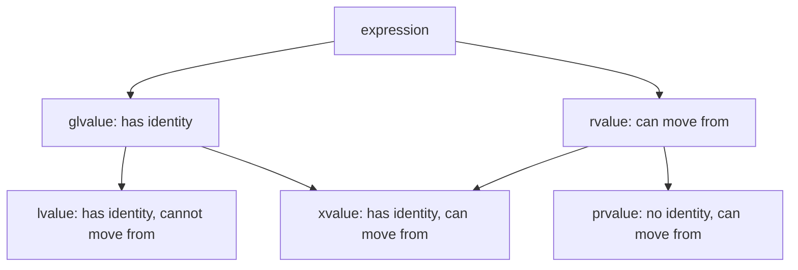

# Modern C++ Tutorial

## Introduction

C++ has undergone significant evolution since the release of C++11, which marked a turning point in the language's history. This tutorial covers the major features introduced in C++11, C++14, C++17, and C++20 that collectively define "Modern C++." These features make C++ safer, more expressive, and often more efficient than its traditional counterpart.

This tutorial assumes you have a solid foundation in traditional C++ (classes, inheritance, templates, STL basics). If you need a refresher, please review the prerequisite materials on traditional C++ concepts.

---

# Part I: C++11 Fundamentals

## Chapter 0: Review

0.1 Lifetime Management: static, mutable, constexpr, volatile

0.2 Class Behavior: final, default, delete, explicit

0.3 Explicit Type Casting: static_cast, const_cast, reinterpret_cast, dynamic_cast

0.4 Multiple Inheritance and The Diamond Problem

0.5 Memory Layout

0.6 Virtual Table

## Chapter 1: Move Semantics and Rvalue References

### 1.1 The Problem: Unnecessary Copies

Consider the following scenario. You have a function that returns a large vector:

```c++
std::vector<int> createLargeVector() {
    std::vector<int> result(1000000, 42);  // 1 million elements
    return result;
}

int main() {
    std::vector<int> myVector = createLargeVector();
    // What happens here?
}
```

In traditional C++ (before C++11), this would involve:
1. Creating `result` inside the function
2. Copying `result` to a temporary return value
3. Copying the temporary to `myVector`
4. Destroying the temporary and `result`

That's potentially millions of integers being copied unnecessarily! The compiler might optimize this through Return Value Optimization (RVO), but we couldn't always rely on it, and it didn't solve all cases.

### 1.2 Understanding Value Categories

To understand move semantics, we must first understand value categories more deeply.

In C++11 and later, every expression has a value category that determines:
- Whether it has identity (can be compared to other objects, can have address taken)
- Whether it can be moved from



**Lvalues** are expressions that refer to a persistent memory location:
- Variable names: `x`, `myVector`
- Dereferenced pointers: `*ptr`
- Array subscript expressions: `arr[5]`
- The result of prefix increment: `++i`

**Rvalues** are expressions that are either:
- Literals: `42`, `3.14`, `'a'`
- The result of expressions: `x + y`, `x++`
- Temporary objects: `std::string("hello")`
- The result of functions returning by value: `createLargeVector()`

Consider the following example:

```c++
int x = 10;           // x is an lvalue
int y = x + 5;        // x + 5 is an rvalue
int z = x;            // x is an lvalue, used as rvalue here

std::string s1 = "Hello";
std::string s2 = s1 + " World";  // s1 + " World" is an rvalue
std::string s3 = std::move(s1);  // std::move(s1) is an xvalue
```

### 1.3 Rvalue References

C++11 introduces **rvalue references**, denoted by `T&&`. An rvalue reference can bind to rvalues but not to lvalues.

```c++
void process(int& x) {
    std::cout << "Lvalue reference: " << x << std::endl;
}

void process(int&& x) {
    std::cout << "Rvalue reference: " << x << std::endl;
}

int main() {
    int a = 10;
    process(a);          // Calls lvalue version
    process(10);         // Calls rvalue version
    process(a + 5);      // Calls rvalue version
    process(std::move(a)); // Calls rvalue version
}
```

Output:
```
Lvalue reference: 10
Rvalue reference: 10
Rvalue reference: 15
Rvalue reference: 10
```

### 1.4 The Move Constructor and Move Assignment Operator

When we have an rvalue reference, we know the object is temporary or about to be destroyed. This allows us to "steal" its resources instead of copying them.

Let's implement a simple string class to demonstrate:

```c++
class MyString {
private:
    char* data;
    size_t length;

public:
    // Regular constructor
    MyString(const char* str = "") {
        length = strlen(str);
        data = new char[length + 1];
        strcpy(data, str);
        std::cout << "Constructor: " << data << std::endl;
    }
    
    // Destructor
    ~MyString() {
        std::cout << "Destructor: " << (data ? data : "null") << std::endl;
        delete[] data;
    }
    
    // Copy constructor
    MyString(const MyString& other) {
        length = other.length;
        data = new char[length + 1];
        strcpy(data, other.data);
        std::cout << "Copy constructor: " << data << std::endl;
    }
    
    // Move constructor
    MyString(MyString&& other) noexcept {
        // Steal resources
        data = other.data;
        length = other.length;
        
        // Leave other in valid state
        other.data = nullptr;
        other.length = 0;
        
        std::cout << "Move constructor: " << data << std::endl;
    }
    
    // Copy assignment operator
    MyString& operator=(const MyString& other) {
        if (this != &other) {
            delete[] data;
            length = other.length;
            data = new char[length + 1];
            strcpy(data, other.data);
            std::cout << "Copy assignment: " << data << std::endl;
        }
        return *this;
    }
    
    // Move assignment operator
    MyString& operator=(MyString&& other) noexcept {
        if (this != &other) {
            delete[] data;
            
            // Steal resources
            data = other.data;
            length = other.length;
            
            // Leave other in valid state
            other.data = nullptr;
            other.length = 0;
            
            std::cout << "Move assignment: " << data << std::endl;
        }
        return *this;
    }
    
    const char* c_str() const { return data ? data : ""; }
};
```

Now let's see how this works in practice:

```c++
MyString createString() {
    MyString temp("Hello from function");
    return temp;  // May use move constructor or RVO
}

int main() {
    std::cout << "=== Creating s1 ===" << std::endl;
    MyString s1("Hello");
    
    std::cout << "\n=== Copy construction ===" << std::endl;
    MyString s2 = s1;
    
    std::cout << "\n=== Move construction ===" << std::endl;
    MyString s3 = std::move(s1);
    
    std::cout << "\n=== Creating from function ===" << std::endl;
    MyString s4 = createString();
    
    std::cout << "\n=== End of main ===" << std::endl;
}
```

### 1.5 std::move Explained

`std::move` doesn't actually move anything! It's a cast that converts an lvalue into an rvalue reference.

Think of `std::move` as saying: "I promise I won't use this object's value again, so you can steal its resources."

**Important**: After calling `std::move` on an object, you should not use its value (though the object remains in a valid, destructible state):

```c++
std::string a = "Hello";
std::string b = std::move(a);
// a is now in an unspecified but valid state
// It's safe to assign to a or destroy it
// But don't assume it has any particular value
std::cout << a << std::endl;  // UB? No, but might print empty string
a = "New value";  // OK, can assign new value
```

### 1.6 The Rule of Five

With move semantics, the Rule of Three becomes the **Rule of Five**. If a class manages resources, you should define:

1. **Destructor** - Release resources
2. **Copy constructor** - Deep copy resources
3. **Copy assignment operator** - Deep copy resources
4. **Move constructor** - Transfer ownership of resources
5. **Move assignment operator** - Transfer ownership of resources

```c++
class ResourceOwner {
private:
    int* data;
    size_t size;

public:
    // Constructor
    ResourceOwner(size_t n = 0) : data(n ? new int[n] : nullptr), size(n) {}
    
    // 1. Destructor
    ~ResourceOwner() { delete[] data; }
    
    // 2. Copy constructor
    ResourceOwner(const ResourceOwner& other) 
        : data(other.size ? new int[other.size] : nullptr)
        , size(other.size) {
        std::copy(other.data, other.data + size, data);
    }
    
    // 3. Copy assignment
    ResourceOwner& operator=(const ResourceOwner& other) {
        if (this != &other) {
            ResourceOwner temp(other);  // Copy constructor
            std::swap(data, temp.data);
            std::swap(size, temp.size);
        }
        return *this;
    }
    
    // 4. Move constructor
    ResourceOwner(ResourceOwner&& other) noexcept 
        : data(other.data), size(other.size) {
        other.data = nullptr;
        other.size = 0;
    }
    
    // 5. Move assignment
    ResourceOwner& operator=(ResourceOwner&& other) noexcept {
        if (this != &other) {
            delete[] data;
            data = other.data;
            size = other.size;
            other.data = nullptr;
            other.size = 0;
        }
        return *this;
    }
};
```

### 1.7 `std::copy` and `noexcept`

The standard library can specialize `std::copy` for built-in types. For `int`, it may use `memcpy` or SIMD vectorized instructions, which copy memory much faster than element-by-element assignment.

```c++
// Manual approach - works but suboptimal
for (size_t i = 0; i < size; ++i) {
    data[i] = other.data[i];
}
```

This produces correct results, but the compiler has less information to optimize. 

The move constructor and move assignment operator are marked with `noexcept`:

`noexcept` is a specifier that promises a function will not throw exceptions. If an exception is thrown inside a `noexcept` function, the program will call `std::terminate()` rather than unwinding the stack.

Move operations that simply transfer pointers and primitive values cannot fail - there's no memory allocation, no external calls, nothing that can throw. By marking them `noexcept`, we tell the compiler this fact, enabling additional optimizations.

Standard library containers like `std::vector` face a critical decision when they need to reallocate (e.g., when `push_back` needs more capacity). They have two strategies:

1. **If the element type has a `noexcept` move constructor:** Move all elements to the new memory location. This is fast - just pointer transfers.

2. **If the move constructor might throw:** Copy all elements instead. This is slower but provides the strong exception guarantee - if copying fails, the original container is unchanged.

For large vectors, this difference can be enormous in performance. If `noexcept` is not specified, the compiler assumes the worst and copies elements during reallocation, defeating the purpose of move semantics.

### 1.8 Copy-and-Swap

The copy assignment operator uses a seemingly unusual pattern:

```c++
ResourceOwner& operator=(const ResourceOwner& other) {
    if (this != &other) {
        ResourceOwner temp(other);  // Create a temporary copy
        std::swap(data, temp.data); // Swap our data with temp's
        std::swap(size, temp.size);
    }
    return *this;
}  // temp is destroyed here, cleaning up our old data
```

This pattern, called "copy-and-swap," creates a local copy of the source, then swaps our resources with that copy. When `temp` goes out of scope, its destructor cleans up what was our old data.

The key benefit is **strong exception safety**. Consider what happens if allocation fails at step 1:

```c++
ResourceOwner a(100);
ResourceOwner b(50);
try {
    a = b;  // If allocation fails here...
} catch (...) {
    // a is still valid with its original 100 elements!
    // We can continue using a as if nothing happened
}
```

The strong exception guarantee means: either the operation succeeds completely, or it has no effect at all. The object is never left in a broken state.

**What happens with a naive approach:**

```c++
ResourceOwner& operator=(const ResourceOwner& other) {
    if (this != &other) {
        delete[] data;              // Step 1: Destroy old data
        data = new int[other.size]; // Step 2: Allocate new data
        size = other.size;
        std::copy(other.data, other.data + size, data);
    }
    return *this;
}
```

This has a critical flaw. If `new int[other.size]` throws `std::bad_alloc`:

1. `data` already points to deleted memory (step 1 executed)
2. `size` still has its old value
3. The object is now in an inconsistent state - `data` is a dangling pointer!

Any subsequent use of this object would cause undefined behavior. The copy-and-swap idiom elegantly avoids this problem.

The copy-and-swap idiom relies on `std::swap`. For most types, `std::swap` uses a three-way exchange with move semantics:

```c++
template<typename T>
void swap(T& a, T& b) {
    T temp = std::move(a);  // Move a to temp
    a = std::move(b);       // Move b to a
    b = std::move(temp);    // Move temp to b
}
```

For pointers and primitive types (like `int*` and `size_t`), this compiles to extremely efficient code - typically just a few register operations.

### 1.9 When to Use Move Semantics

Move semantics are most beneficial when:

1. **Returning large objects from functions**:
   ```c++
   std::vector<int> createVector() {
       std::vector<int> result;
       // ... populate result ...
       return result;  // Move or RVO
   }
   ```

2. **Storing objects in containers**:
   ```c++
   std::vector<std::string> names;
   std::string name = "Alice";
   names.push_back(std::move(name));  // Move instead of copy
   ```

3. **Transferring ownership**:
   ```c++
   std::unique_ptr<Resource> ptr = std::make_unique<Resource>();
   std::unique_ptr<Resource> newPtr = std::move(ptr);  // Transfer ownership
   ```

---

## Chapter 2: Smart Pointers

### 2.1 The Problem with Raw Pointers

Raw pointers have several issues:
1. **Memory leaks**: Forgetting to `delete`
2. **Double delete**: Deleting the same memory twice
3. **Dangling pointers**: Using memory after it's been freed
4. **Exception safety**: If an exception is thrown, cleanup might be skipped

```c++
void badFunction() {
    int* ptr = new int(42);
    // ... something that might throw ...
    delete ptr;  // May never be reached!
}
```

### 2.2 RAII: Resource Acquisition Is Initialization

RAII is a programming idiom where resource management is tied to object lifetime:
- **Acquire** resources in the constructor
- **Release** resources in the destructor

Since destructors are called automatically when objects go out of scope (even during stack unwinding from exceptions), resources are guaranteed to be released.

Smart pointers are RAII wrappers for raw pointers.

### 2.3 std::unique_ptr

`std::unique_ptr` represents **exclusive ownership**. It cannot be copied, only moved. This makes it the most efficient smart pointer with zero overhead compared to a raw pointer.

#### Understanding `make_unique`

```c++
// Direct construction with new
std::unique_ptr<Resource> ptr1(new Resource(1));

// Using make_unique (C++14) - PREFERRED
auto ptr2 = std::make_unique<Resource>(2);
```

`std::make_unique<T>(args...)` creates a `unique_ptr<T>` by allocating memory for a `T` object and constructing it with the provided arguments, all in a single function call.
```c++
template<typename T, typename... Args>
std::unique_ptr<T> make_unique(Args&&... args) {
    return std::unique_ptr<T>(new T(std::forward<Args>(args)...));
}
```

**Why choose `make_unique` over `new`:**

1. **Exception safety:** Consider this function call:
   ```c++
   function(std::unique_ptr<Resource>(new Resource(1)), 
            std::unique_ptr<Resource>(new Resource(2)));
   ```
   The compiler may evaluate this as: `new Resource(1)`, `new Resource(2)`, then construct the `unique_ptr`s. If the second `new` throws, the first allocation leaks! With `make_unique`:
   ```c++
   function(std::make_unique<Resource>(1), 
            std::make_unique<Resource>(2));
   ```
   Each allocation is immediately wrapped in a `unique_ptr`, so no leak is possible.

2. **No `new` keyword:** Eliminates the possibility of forgetting to use `make_unique` or mismatching `new`/`delete`.

3. **Consistency:** Matches the style of `make_shared` (covered next).

#### Practical Example: Factory Function with `unique_ptr`

```c++
#include <memory>
#include <iostream>

class Shape {
public:
    virtual ~Shape() = default;
    virtual void draw() const = 0;
};

class Circle : public Shape {
    double radius;
public:
    explicit Circle(double r) : radius(r) {}
    void draw() const override {
        std::cout << "Drawing circle with radius " << radius << "\n";
    }
};

class Rectangle : public Shape {
    double width, height;
public:
    Rectangle(double w, double h) : width(w), height(h) {}
    void draw() const override {
        std::cout << "Drawing rectangle " << width << "x" << height << "\n";
    }
};

// Factory function returning unique_ptr
std::unique_ptr<Shape> createShape(const std::string& type, double a, double b = 0) {
    if (type == "circle") {
        return std::make_unique<Circle>(a);
    } else if (type == "rectangle") {
        return std::make_unique<Rectangle>(a, b);
    }
    throw std::invalid_argument("Unknown shape type");
}

int main() {
    // Create shapes through factory
    auto shape1 = createShape("circle", 5.0);
    auto shape2 = createShape("rectangle", 3.0, 4.0);
    
    // Use polymorphically
    shape1->draw();  // Drawing circle with radius 5
    shape2->draw();  // Drawing rectangle 3x4
    
    // Transfer ownership to another unique_ptr
    std::unique_ptr<Shape> shape3 = std::move(shape1);
    // shape1 is now nullptr
    
    // Store in container
    std::vector<std::unique_ptr<Shape>> shapes;
    shapes.push_back(std::move(shape2));
    shapes.push_back(std::move(shape3));
    
    // Draw all shapes
    for (const auto& shape : shapes) {
        shape->draw();
    }
    // All shapes automatically destroyed when vector goes out of scope
}
```

### 2.4 std::shared_ptr

`std::shared_ptr` represents **shared ownership**. Multiple `shared_ptr` instances can point to the same object. The object is destroyed when the last `shared_ptr` pointing to it is destroyed or reset.

#### Understanding `make_shared`

```c++
// Direct construction with new
std::shared_ptr<Resource> ptr1(new Resource(1));

// Using make_shared - PREFERRED
auto ptr2 = std::make_shared<Resource>(2);
```

`std::make_shared<T>(args...)` creates a `shared_ptr<T>` in a single memory allocation that contains both the object and the control block (which holds the reference counts).

```
Direct new:                make_shared:
┌──────────┐              ┌────────────────────┐
│  Object  │              │   Control Block    │
└──────────┘              │  ┌──────────────┐  │
                          │  │ strong_count │  │
┌──────────────┐          │  │ weak_count   │  │
│ Control Block│          │  └──────────────┘  │
│ strong_count │          │  ┌──────────────┐  │
│ weak_count   │          │  │    Object    │  │
└──────────────┘          │  └──────────────┘  │
                          └────────────────────┘
 TWO allocations           ONE allocation
```

**Why choose `make_shared`:**

1. **Performance:** One allocation instead of two. For frequently created objects, this is a significant optimization.

2. **Exception safety:** Same benefit as `make_unique` - no leak possible in complex expressions.

3. **Memory locality:** The object and control block are adjacent in memory, potentially improving cache performance.

#### Understanding `use_count`

```c++
auto ptr1 = std::make_shared<Resource>(1);
std::cout << ptr1.use_count();  // 1

auto ptr2 = ptr1;
std::cout << ptr1.use_count();  // 2
std::cout << ptr2.use_count();  // 2 (same count!)
```

The control block maintains a thread-safe reference counter. Each time a `shared_ptr` is copied, the counter is atomically incremented. Each time one is destroyed, it's atomically decremented. When the count reaches zero, the object is destroyed.

```c++
// When you copy a shared_ptr:
auto ptr2 = ptr1;  // Atomic increment: ++control_block->strong_count

// When a shared_ptr is destroyed:
~shared_ptr() {
    if (--control_block->strong_count == 0) {
        delete object;  // Destroy the managed object
        if (control_block->weak_count == 0) {
            delete control_block;
        }
    }
}
```

#### Practical Example: Shared Resource Cache

```c++
#include <memory>
#include <iostream>
#include <string>
#include <map>

class ExpensiveResource {
    std::string name;
public:
    explicit ExpensiveResource(const std::string& n) : name(n) {
        std::cout << "Creating expensive resource: " << name << "\n";
    }
    ~ExpensiveResource() {
        std::cout << "Destroying expensive resource: " << name << "\n";
    }
    void use() { std::cout << "Using " << name << "\n"; }
};

class ResourceCache {
    std::map<std::string, std::shared_ptr<ExpensiveResource>> cache;
public:
    std::shared_ptr<ExpensiveResource> get(const std::string& name) {
        auto it = cache.find(name);
        if (it != cache.end()) {
            std::cout << "Reusing cached resource: " << name 
                      << " (use_count: " << it->second.use_count() << ")\n";
            return it->second;
        }
        
        auto resource = std::make_shared<ExpensiveResource>(name);
        cache[name] = resource;
        std::cout << "Created new resource: " << name << "\n";
        return resource;
    }
    
    void stats() {
        std::cout << "\nCache stats:\n";
        for (const auto& [name, ptr] : cache) {
            std::cout << "  " << name << ": use_count = " << ptr.use_count() << "\n";
        }
    }
};

int main() {
    ResourceCache cache;
    
    // First request creates the resource
    auto r1 = cache.get("database_connection");
    std::cout << "use_count after first get: " << r1.use_count() << "\n\n";
    
    // Second request returns the cached instance
    auto r2 = cache.get("database_connection");
    std::cout << "use_count after second get: " << r2.use_count() << "\n\n";
    
    // Different name creates new resource
    auto r3 = cache.get("file_handle");
    std::cout << "use_count for file_handle: " << r3.use_count() << "\n\n";
    
    cache.stats();
    
    std::cout << "\n--- Releasing r1 ---\n";
    r1.reset();  // Release one reference
    cache.stats();
    
    std::cout << "\n--- Releasing r2 ---\n";
    r2.reset();  // Release second reference
    std::cout << "After r2 reset, cache still holds resource\n";
    cache.stats();
    
    std::cout << "\n--- End of main ---\n";
    // All remaining resources destroyed when cache is destroyed
}
```

### 2.5 std::weak_ptr

`weak_ptr` is a non-owning observer that doesn't affect the reference count. It's useful for:
- Breaking circular references
- Caching
- Observer patterns

#### Understanding `lock`

```c++
std::weak_ptr<Resource> weak = sharedPtr;

// Attempt to access the resource
if (auto locked = weak.lock()) {
    locked->use();  // Safe: object is still alive
} else {
    std::cout << "Object has been destroyed\n";
}
```

`lock()` attempts to obtain a `shared_ptr` from a `weak_ptr`. If the object still exists, it returns a valid `shared_ptr` (which increments the reference count). If the object has been destroyed, it returns an empty `shared_ptr`.

```c++
std::shared_ptr<T> weak_ptr<T>::lock() const noexcept {
    // Check if object still exists (strong_count > 0)
    if (expired()) {
        return std::shared_ptr<T>();  // Return empty shared_ptr
    }
    // Atomically increment strong_count and return shared_ptr
    return std::shared_ptr<T>(*this);
}
```

A `weak_ptr` cannot directly access the object because the object might be destroyed at any moment by another thread. The `lock()` function provides thread-safe access by:
1. Checking if the object still exists
2. If it exists, incrementing the reference count atomically
3. Returning a `shared_ptr` that keeps the object alive

**What happens without `lock`:**
```c++
// WRONG: weak_ptr doesn't have operator-> or operator*
weak_ptr<Resource> weak = sharedPtr;
weak->use();  // COMPILATION ERROR!

// The whole point is that the object might not exist anymore!
// You MUST check with lock() before using.
```

#### Understanding Reference Counting with `weak_ptr`

The control block actually maintains two counts:
- **strong_count**: Number of `shared_ptr` instances
- **weak_count**: Number of `weak_ptr` instances

```c++
auto shared = std::make_shared<Resource>(1);
std::weak_ptr<Resource> weak = shared;

// strong_count = 1, weak_count = 1

shared.reset();  // Object destroyed, but control block stays!
// strong_count = 0, weak_count = 1

// Object is gone, but control block lives until all weak_ptrs are gone
if (auto locked = weak.lock()) {
    // Won't execute: object is destroyed
} else {
    std::cout << "Object expired\n";
}

weak.reset();  // Now control block can be destroyed
// strong_count = 0, weak_count = 0 → control block destroyed
```

#### Practical Example: Observer Pattern with `weak_ptr`

```c++
#include <memory>
#include <iostream>
#include <vector>
#include <algorithm>

class Subject;

class Observer {
public:
    virtual ~Observer() = default;
    virtual void update(Subject* subject) = 0;
};

class Subject {
    std::vector<std::weak_ptr<Observer>> observers;  // weak_ptr, not shared_ptr!
public:
    void attach(std::shared_ptr<Observer> observer) {
        observers.push_back(observer);
    }
    
    void notify() {
        // Remove expired observers first
        observers.erase(
            std::remove_if(observers.begin(), observers.end(),
                [](const std::weak_ptr<Observer>& weak) {
                    return weak.expired();
                }),
            observers.end()
        );
        
        // Notify remaining observers
        for (auto& weak : observers) {
            if (auto observer = weak.lock()) {
                observer->update(this);
            }
        }
    }
};

class ConsoleObserver : public Observer {
    std::string name;
public:
    explicit ConsoleObserver(const std::string& n) : name(n) {
        std::cout << "Observer " << name << " created\n";
    }
    ~ConsoleObserver() {
        std::cout << "Observer " << name << " destroyed\n";
    }
    void update(Subject* subject) override {
        std::cout << "Observer " << name << " received notification\n";
    }
};

int main() {
    Subject subject;
    
    // Create observers
    auto obs1 = std::make_shared<ConsoleObserver>("Observer-1");
    auto obs2 = std::make_shared<ConsoleObserver>("Observer-2");
    auto obs3 = std::make_shared<ConsoleObserver>("Observer-3");
    
    // Attach observers
    subject.attach(obs1);
    subject.attach(obs2);
    subject.attach(obs3);
    
    std::cout << "\n--- First notification (all observers) ---\n";
    subject.notify();
    
    std::cout << "\n--- Observer-2 goes out of scope ---\n";
    obs2.reset();  // Observer-2 is destroyed
    
    std::cout << "\n--- Second notification (only 1 and 3) ---\n";
    subject.notify();  // Automatically skips destroyed observer
    
    std::cout << "\n--- End of main ---\n";
}
```

**Why `weak_ptr` is essential here:**

If we used `shared_ptr<Observer>` in the Subject, the Observer would never be destroyed as long as the Subject exists - even if the user wants to remove it. This creates unintended strong references. With `weak_ptr`:
- Observers can be destroyed anytime
- Subject automatically detects expired observers
- No memory leaks from circular references

### 2.6 The `auto` Keyword and `auto_ptr` History

Before C++11, type declarations could become extremely verbose:

```c++
// Before C++11 - very verbose
std::map<std::string, std::vector<int>>::iterator it = myMap.begin();
std::pair<std::map<std::string, int>::iterator, bool> result = myMap.insert({key, value});

// With auto - clean and readable
auto it = myMap.begin();
auto result = myMap.insert({key, value});
```

```c++
// Without auto - type repeated twice
std::unique_ptr<Resource> ptr = std::make_unique<Resource>(1);

// With auto - DRY principle
auto ptr = std::make_unique<Resource>(1);
```

Then what about pointers? Can we use `auto` with them, not just for type declarations, but for pointer operations as well?

#### The `auto_ptr` Story: A Failed First Attempt

Before `unique_ptr`, C++ introduced `auto_ptr` in C++98 as the first smart pointer. It was deprecated in C++11 and removed in C++17.

**How `auto_ptr` was intended to work:**
- To provide automatic memory management
- To ensure resources are freed when the pointer goes out of scope
- To enable ownership transfer between pointers

**The fundamental problem:**

```c++
std::auto_ptr<int> p1(new int(42));
std::auto_ptr<int> p2 = p1;  // Looks like a copy...

std::cout << *p1;  // DANGER! p1 is now nullptr!
```

`auto_ptr` attempted to provide unique ownership but through copy semantics. When you "copied" an `auto_ptr`, it transferred ownership and left the source as nullptr.

**Why this caused bugs:**

```c++
void process(std::auto_ptr<int> p) {
    std::cout << *p << "\n";
}  // p is destroyed here, along with the int!

int main() {
    std::auto_ptr<int> myPtr(new int(42));
    process(myPtr);  // Ownership transferred to function parameter
    
    std::cout << *myPtr;  // CRASH! myPtr is nullptr
    // The int was deleted when process() returned
}
```

### 2.7 Smart Pointer Comparison

| Aspect | unique_ptr | shared_ptr |
|--------|-----------|------------|
| Ownership | Exclusive | Shared |
| Overhead | Minimal (just a pointer) | Control block + atomic operations |
| Copyable | No (only movable) | Yes |
| Use case | Default choice, single owner | Multiple owners needed |
| Performance | Better | Slightly worse |

**Guidelines**:
1. Use `unique_ptr` by default
2. Use `shared_ptr` when ownership truly needs to be shared
3. Use `weak_ptr` for non-owning references or to break cycles
4. Never use `auto_ptr` (deprecated in C++11, removed in C++17)

---

## Chapter 3: Auto and Type Deduction

### 3.1 The auto Keyword

C++11 introduced `auto` for automatic type deduction from the initializer:

```c++
auto x = 42;              // int
auto y = 3.14;            // double
auto s = "hello";         // const char*
auto str = std::string("hello");  // std::string
auto vec = std::vector<int>{1, 2, 3};  // std::vector<int>

// With complex types, auto shines
std::map<std::string, std::vector<int>> myMap;
std::map<std::string, std::vector<int>>::iterator it1 = myMap.begin();  // Verbose
auto it2 = myMap.begin();  // Clean!
```

### 3.2 Type Deduction Rules

The rules for `auto` type deduction are similar to template type deduction:

```c++
// Case 1: Reference and top-level const are ignored
int x = 10;
int& ref = x;
const int cx = x;

auto a = x;     // int
auto b = ref;   // int (reference is stripped)
auto c = cx;    // int (const is stripped)

// To keep const or reference, use auto& or const auto&
auto& d = cx;   // const int&
const auto& e = x;  // const int&

// Case 2: With pointers
int* ptr = &x;
auto p1 = ptr;   // int*
auto* p2 = ptr;  // int* (same as above)
const auto* p3 = ptr;  // const int*

// Case 3: Universal references (auto&&)
auto&& r1 = x;    // int& (lvalue)
auto&& r2 = 42;   // int&& (rvalue)
```

### 3.3 auto with Functions (C++14)

C++14 allows `auto` for function return type deduction:

```c++
// Automatic return type deduction
auto add(int a, int b) {
    return a + b;  // return type is int
}

// Works with complex types
auto createMap() {
    return std::map<std::string, int>{{"one", 1}, {"two", 2}};
}

// Generic lambdas (C++14)
auto lambda = [](auto x, auto y) {
    return x + y;
};
```

### 3.4 decltype

`decltype` returns the exact type of an expression without evaluating it:

```c++
int x = 10;
decltype(x) y = 20;       // int
decltype(x + 5) z = 15;   // int (expression type)

const int& ref = x;
decltype(ref) r = x;      // const int& (preserves reference and const)

// Important: decltype with parentheses
decltype((x)) ref2 = x;   // int& (extra parentheses make it an lvalue expression)
```

### 3.5 Best Practices with auto

**Do use auto when:**
- Type is obvious from context: `auto p = std::make_unique<Widget>();`
- Type is verbose: `auto it = myMap.find(key);`
- Range-based for loops: `for (auto& item : container)`
- Lambda expressions: `auto callback = [](int x) { return x * 2; };`

**Don't use auto when:**
- Type is important for understanding: `auto z = foo();` (What is z?)
- You want a specific type conversion: `auto x = 42;` when you need `long`

**Prefer `const auto&` for read-only access:**
```c++
std::vector<std::string> names = {"Alice", "Bob", "Charlie"};

// Avoid unnecessary copies
for (const auto& name : names) {
    std::cout << name << "\n";
}

// Modify in place
for (auto& name : names) {
    name += " Smith";
}
```

---

## Chapter 4: Lambda Expressions

### 4.1 Introduction to Lambdas

Lambda expressions (introduced in C++11) allow creating anonymous functions inline. They're especially useful for short operations passed to algorithms.

```c++
#include <algorithm>
#include <vector>
#include <iostream>

int main() {
    std::vector<int> numbers = {5, 2, 8, 1, 9, 3, 7, 4, 6};
    
    // Traditional way with function object
    struct IsEven {
        bool operator()(int n) const { return n % 2 == 0; }
    };
    int evenCount = std::count_if(numbers.begin(), numbers.end(), IsEven());
    
    // With lambda
    int evenCount2 = std::count_if(numbers.begin(), numbers.end(), 
                                   [](int n) { return n % 2 == 0; });
    
    std::cout << "Even numbers: " << evenCount2 << "\n";
}
```

### 4.2 Lambda Syntax

The complete lambda syntax:

```
[captures](parameters) mutable -> return_type { body }
```

- **captures**: Variables from the enclosing scope to capture
- **parameters**: Function parameters (can be auto in C++14)
- **mutable**: Allow modification of captured-by-value variables
- **return_type**: Explicit return type (usually auto-deduced)
- **body**: Function body

### 4.3 Capture Modes

```c++
int x = 10;
int y = 20;

// Capture nothing
auto f1 = []() { return 42; };

// Capture by value
auto f2 = [x]() { return x * 2; };

// Capture by reference
auto f3 = [&x]() { x++; };

// Capture all by value
auto f4 = [=]() { return x + y; };

// Capture all by reference
auto f5 = [&]() { x++; y++; };

// Mixed capture
auto f6 = [=, &x]() { x = y; };  // y by value, x by reference

// Capture specific variables
auto f7 = [x, &y]() { y += x; };
```

### 4.4 Capture Examples

```c++
#include <iostream>
#include <vector>
#include <algorithm>

int main() {
    std::vector<int> values = {1, 2, 3, 4, 5};
    int threshold = 3;
    
    // Using captured variable
    auto countAbove = std::count_if(values.begin(), values.end(),
        [threshold](int v) { return v > threshold; });
    std::cout << "Values above " << threshold << ": " << countAbove << "\n";
    
    // Modifying captured reference
    int sum = 0;
    std::for_each(values.begin(), values.end(),
        [&sum](int v) { sum += v; });
    std::cout << "Sum: " << sum << "\n";
    
    // Capturing by value and modifying the copy (needs mutable)
    int counter = 0;
    auto incrementer = [counter]() mutable { 
        counter++; 
        return counter; 
    };
    std::cout << incrementer() << " " << incrementer() << " " << incrementer() << "\n";
    // Original counter is still 0!
    std::cout << "Original counter: " << counter << "\n";
}
```

### 4.5 Generic Lambdas (C++14)

C++14 allows `auto` in lambda parameters:

```c++
// Works with any type that supports +
auto add = [](auto a, auto b) { return a + b; };

int i = add(1, 2);           // int
double d = add(1.5, 2.5);    // double
std::string s = add(std::string("Hello "), std::string("World"));
```

### 4.6 Lambda and Standard Algorithms

Lambdas shine with standard library algorithms:

```c++
#include <algorithm>
#include <vector>
#include <iostream>
#include <string>

int main() {
    std::vector<std::string> words = {"apple", "banana", "cherry", "date", "elderberry"};
    
    // Sort by length
    std::sort(words.begin(), words.end(), 
              [](const std::string& a, const std::string& b) {
                  return a.length() < b.length();
              });
    
    // Find first word containing 'n'
    auto it = std::find_if(words.begin(), words.end(),
                           [](const std::string& s) {
                               return s.find('n') != std::string::npos;
                           });
    if (it != words.end()) {
        std::cout << "Found: " << *it << "\n";
    }
    
    // Transform all words to uppercase
    std::transform(words.begin(), words.end(), words.begin(),
                   [](std::string s) {
                       std::transform(s.begin(), s.end(), s.begin(), ::toupper);
                       return s;
                   });
}
```

---

## Chapter 5: Range-Based For Loops

### 5.1 Basic Syntax

C++11 introduced a cleaner syntax for iterating over containers:

```c++
std::vector<int> numbers = {1, 2, 3, 4, 5};

// Traditional way
for (std::vector<int>::iterator it = numbers.begin(); it != numbers.end(); ++it) {
    std::cout << *it << " ";
}

// Range-based for loop
for (int n : numbers) {
    std::cout << n << " ";
}

// With auto
for (auto n : numbers) {
    std::cout << n << " ";
}
```

### 5.2 Reference vs Value

```c++
std::vector<std::string> words = {"hello", "world"};

// By value: copies each element
for (auto word : words) {
    word += "!";  // Modifies the copy
}
// words is unchanged

// By reference: modifies actual elements
for (auto& word : words) {
    word += "!";  // Modifies the actual elements
}
// words now contains {"hello!", "world!"}

// By const reference: read-only, no copy
for (const auto& word : words) {
    std::cout << word << " ";  // No copy
    // word += "?";  // Error: const
}
```

### 5.3 How It Works

The range-based for loop works with any type that supports:
1. `begin()` and `end()` member functions, or
2. `begin(c)` and `end(c)` free functions (ADL)

```c++
// Works with many types
int arr[] = {1, 2, 3, 4, 5};
for (int n : arr) { std::cout << n << " "; }

std::map<std::string, int> ages = {{"Alice", 30}, {"Bob", 25}};
for (const auto& pair : ages) {
    std::cout << pair.first << ": " << pair.second << "\n";
}

std::string text = "Hello";
for (char c : text) {
    std::cout << c << "-";
}

for (int n : {1, 2, 3, 4, 5}) {
    std::cout << n << " ";
}
```

---

## Chapter 6: nullptr and Strongly-Typed Enums

### 6.1 The Problem with NULL

In traditional C++, `NULL` is typically defined as `0` (integer), which can cause issues:

```c++
void f(int) { std::cout << "f(int)\n"; }
void f(int*) { std::cout << "f(int*)\n"; }

int main() {
    f(0);      // f(int)
    f(NULL);   // f(int) on most systems! Not f(int*)!
}
```

### 6.2 nullptr

C++11 introduces `nullptr`, a literal of type `std::nullptr_t`:

```c++
void f(int) { std::cout << "f(int)\n"; }
void f(int*) { std::cout << "f(int*)\n"; }

int main() {
    f(0);         // f(int)
    f(NULL);      // f(int) (usually)
    f(nullptr);   // f(int*) - correct!
    
    int* p = nullptr;
    if (p == nullptr) {  // Clear and correct
        std::cout << "p is null\n";
    }
}
```

### 6.3 Strongly-Typed Enums (enum class)

Traditional enums have problems:

```c++
enum Color { RED, GREEN, BLUE };
enum Size { SMALL, MEDIUM, LARGE };

// Problem 1: Enumerators leak into enclosing scope
int x = RED;  // OK, but might conflict

// Problem 2: No type safety
Color c = RED;
Size s = SMALL;
// if (c == s) { ... }  // Compiles! Comparing different types
```

C++11 introduces `enum class`:

```c++
enum class Color { RED, GREEN, BLUE };
enum class Size { SMALL, MEDIUM, LARGE };

int main() {
    // Problem 1 solved: Scoped
    Color c = Color::RED;  // Must use scope
    // int x = RED;  // Error!
    
    // Problem 2 solved: Type safe
    Size s = Size::SMALL;
    // if (c == s) { }  // Error! Different types
    
    // Converting to integer requires cast
    int colorVal = static_cast<int>(Color::RED);
}
```

---

## Chapter 7: constexpr and Compile-Time Computation

### 7.1 Constant Expressions

A constant expression is an expression that can be evaluated at compile time. C++11 introduced `constexpr` to explicitly specify that a value or function should be computed at compile time.

```c++
// const vs constexpr
const int a = 42;              // May be evaluated at runtime
constexpr int b = 42;          // Must be evaluated at compile time

// Useful for array sizes, template arguments, etc.
constexpr int SIZE = 10;
int arr[SIZE];  // OK
std::array<int, SIZE> stdArr;  // OK
```

### 7.2 constexpr Functions

C++11 constexpr functions must have a single return statement (relaxed in C++14):

```c++
// C++11: Single return statement
constexpr int square(int x) {
    return x * x;
}

constexpr int result = square(5);  // Computed at compile time

// C++14: Multiple statements allowed
constexpr int factorial(int n) {
    if (n <= 1) return 1;
    return n * factorial(n - 1);
}

// C++14: Local variables and loops
constexpr int fibonacci(int n) {
    if (n <= 1) return n;
    int a = 0, b = 1;
    for (int i = 2; i <= n; ++i) {
        int temp = a + b;
        a = b;
        b = temp;
    }
    return b;
}

static_assert(factorial(5) == 120, "factorial(5) should be 120");
static_assert(fibonacci(10) == 55, "fibonacci(10) should be 55");
```

### 7.3 constexpr if (C++17)

C++17 introduces `if constexpr` for compile-time conditionals:

```c++
template<typename T>
auto get_value(T t) {
    if constexpr (std::is_pointer_v<T>) {
        return *t;  // Only compiled if T is a pointer
    } else {
        return t;   // Only compiled if T is not a pointer
    }
}

int main() {
    int x = 42;
    std::cout << get_value(x) << "\n";     // 42
    std::cout << get_value(&x) << "\n";    // 42
}
```

---

## Chapter 8: Uniform Initialization and std::initializer_list

### 8.1 Brace-Initialization

C++11 introduced uniform initialization using braces:

```c++
// All types can use brace initialization
int x{5};
double d{3.14};
std::string s{"hello"};

// Arrays
int arr[]{1, 2, 3, 4, 5};

// Containers
std::vector<int> v{1, 2, 3, 4, 5};
std::map<std::string, int> m{{"one", 1}, {"two", 2}};

// Objects
class Widget {
public:
    Widget(int x, int y) : x_(x), y_(y) {}
private:
    int x_, y_;
};
Widget w{10, 20};
```

### 8.2 Narrowing Conversions Prohibited

Brace initialization prevents narrowing conversions:

```c++
int x = 5.5;     // OK: x = 5 (narrowing allowed with warning or silently)
int y{5.5};      // Error: narrowing conversion not allowed!

double d = 3.14;
int a = d;       // OK (with possible warning)
int b{d};        // Error!
```

### 8.3 std::initializer_list

`std::initializer_list<T>` enables initialization with a list of values:

```c++
class MyVector {
    std::vector<int> data;
public:
    MyVector(std::initializer_list<int> init) : data(init) {
        std::cout << "Initializer list constructor: " << data.size() << " elements\n";
    }
    
    MyVector(int size) : data(size) {
        std::cout << "Size constructor: " << size << " elements\n";
    }
};

int main() {
    MyVector v1{1, 2, 3, 4, 5};  // Initializer list constructor
    MyVector v2(5);               // Size constructor
    MyVector v3{5};               // Initializer list constructor (one element)
}
```

---

## Chapter 9: Variadic Templates

### 9.1 Parameter Packs

C++11 introduced variadic templates:

```c++
// Parameter pack: T... args
template<typename... Args>
void print(Args... args) {
    // sizeof...(args) gives the number of arguments
    std::cout << "Number of arguments: " << sizeof...(args) << "\n";
}

int main() {
    print();                    // 0
    print(1);                   // 1
    print(1, 2.5, "hello");     // 3
}
```

### 9.2 Recursive Expansion

The classic way to process parameter packs is recursion:

```c++
// Base case: no arguments
void print() {
    std::cout << "(no more arguments)\n";
}

// Recursive case: at least one argument
template<typename T, typename... Args>
void print(T first, Args... rest) {
    std::cout << first;
    if (sizeof...(rest) > 0) {
        std::cout << ", ";
    }
    print(rest...);  // Recursive call with remaining arguments
}

int main() {
    print(1, 2.5, "hello", 'c');
    // Output: 1, 2.5, hello, c, (no more arguments)
}
```

### 9.3 Fold Expressions (C++17)

C++17 introduced fold expressions for cleaner syntax:

```c++
// All values with binary operator
template<typename... Args>
auto sum(Args... args) {
    return (args + ...);  // Right fold
}

template<typename... Args>
void printAll(Args... args) {
    ((std::cout << args << " "), ...);  // Comma fold
}

int main() {
    std::cout << sum(1, 2, 3, 4, 5) << "\n";  // 15
    printAll(1, "hello", 3.14, 'c');
    // Output: 1 hello 3.14 c
}
```

---

## Chapter 10: Perfect Forwarding

### 10.1 The Forwarding Problem

Consider a factory function that creates objects:

```c++
template<typename T, typename Arg>
std::unique_ptr<T> factory(Arg arg) {
    return std::make_unique<T>(arg);
}

class Widget {
public:
    Widget(int& x) { std::cout << "lvalue ctor\n"; }
    Widget(int&& x) { std::cout << "rvalue ctor\n"; }
};

int main() {
    int x = 42;
    auto w1 = factory<Widget>(x);    // Should call lvalue ctor
    auto w2 = factory<Widget>(42);   // Should call rvalue ctor
    // But both call lvalue ctor because arg is always an lvalue!
}
```

### 10.2 Universal References (Forwarding References)

When `T&&` appears in a template parameter deduction context, it's a universal reference:

```c++
template<typename T>
void func(T&& arg) {
    // arg can bind to both lvalues and rvalues
}

int main() {
    int x = 10;
    func(x);     // T = int&, arg = int&
    func(10);    // T = int, arg = int&&
}
```

### 10.3 std::forward

`std::forward` preserves the value category:

```c++
template<typename T>
void func(T&& arg) {
    process(std::forward<T>(arg));
}

void process(int& x) { std::cout << "lvalue: " << x << "\n"; }
void process(int&& x) { std::cout << "rvalue: " << x << "\n"; }

int main() {
    int x = 42;
    func(x);    // Calls process(int&) - lvalue
    func(42);   // Calls process(int&&) - rvalue
}
```

### 10.4 Perfect Forwarding in Practice

```c++
template<typename T, typename... Args>
std::unique_ptr<T> make(Args&&... args) {
    return std::make_unique<T>(std::forward<Args>(args)...);
}

class ComplexObject {
    std::string name;
    std::vector<int> data;
public:
    ComplexObject(std::string n, std::vector<int> d) 
        : name(std::move(n)), data(std::move(d)) {
        std::cout << "Created " << name << " with " << data.size() << " elements\n";
    }
};

int main() {
    auto obj = make<ComplexObject>(std::string("Test"), std::vector<int>{1, 2, 3});
}
```

---

# Part II: Standard Library Enhancements

## Chapter 11: Enhanced STL Containers

### 11.1 std::array

`std::array` is a fixed-size container that wraps a C-style array:

```c++
#include <array>

int main() {
    // Declaration and initialization
    std::array<int, 5> arr = {1, 2, 3, 4, 5};
    
    // Access elements
    arr[0] = 10;              // No bounds checking
    arr.at(1) = 20;           // Bounds checking
    
    // Front and back
    int& front = arr.front();  // First element
    int& back = arr.back();    // Last element
    
    // Size (compile-time constant)
    std::cout << "Size: " << arr.size() << "\n";
    
    // Fill all elements
    arr.fill(0);
    
    // Get underlying C array
    int* cArray = arr.data();
    
    // Range-based for
    for (int n : arr) {
        std::cout << n << " ";
    }
}
```

**Advantages over C arrays:**
- Knows its own size
- Supports iterators
- Supports comparison operators
- Works with STL algorithms
- No decay to pointer

### 11.2 std::forward_list

A singly-linked list with lower overhead than `std::list`:

```c++
#include <forward_list>

int main() {
    std::forward_list<int> fl = {1, 2, 3, 4, 5};
    
    // No size() method! (O(n) to compute)
    
    // Access front only
    fl.front() = 10;
    
    // Insert at front (O(1))
    fl.push_front(0);
    
    // Remove from front
    fl.pop_front();
    
    // Algorithms specific to forward_list
    fl.unique();           // Remove consecutive duplicates
    fl.sort();             // Sort
    fl.reverse();          // Reverse
}
```

### 11.3 Unordered Containers

C++11 introduced hash-based containers:

```c++
#include <unordered_map>
#include <unordered_set>

int main() {
    // Unordered set
    std::unordered_set<int> uset = {5, 3, 1, 4, 2};
    
    uset.insert(10);
    uset.erase(3);
    
    // Average O(1) lookup
    if (uset.find(5) != uset.end()) {
        std::cout << "Found 5\n";
    }
    
    // Unordered map
    std::unordered_map<std::string, int> umap;
    umap["alice"] = 30;
    umap["bob"] = 25;
}
```

**Comparison: ordered vs unordered containers**

| Feature | map/set | unordered_map/set |
|---------|---------|-------------------|
| Ordering | Sorted | No ordering |
| Lookup time | O(log n) | O(1) average, O(n) worst |
| Insertion time | O(log n) | O(1) average |
| Memory | Less | More (hash table) |

### 11.4 std::tuple

`std::tuple` is a fixed-size collection of heterogeneous values:

```c++
#include <tuple>

int main() {
    // Creating tuples
    std::tuple<int, double, std::string> t1(42, 3.14, "hello");
    auto t2 = std::make_tuple(100, 2.71, std::string("world"));
    
    // Accessing elements (0-indexed)
    std::cout << std::get<0>(t1) << "\n";  // 42
    std::cout << std::get<1>(t1) << "\n";  // 3.14
    std::cout << std::get<2>(t1) << "\n";  // hello
    
    // Get size
    std::cout << std::tuple_size<decltype(t1)>::value << "\n";  // 3
    
    // C++17: Structured bindings
    auto [i, d, s] = t1;  // i = 42, d = 3.14, s = "hello"
}
```

---

## Chapter 12: Type Traits and Metaprogramming

### 12.1 Type Traits Overview

Type traits provide compile-time information about types. They're defined in `<type_traits>`:

```c++
#include <type_traits>

int main() {
    // Primary type categories
    static_assert(std::is_integral<int>::value, "int is integral");
    static_assert(std::is_floating_point<double>::value, "double is floating point");
    static_assert(std::is_pointer<int*>::value, "int* is pointer");
    static_assert(std::is_reference<int&>::value, "int& is reference");
    
    // Type properties
    static_assert(std::is_const<const int>::value, "const int is const");
    static_assert(std::is_trivially_copyable<int>::value, "int is trivially copyable");
    
    // C++17: _v shortcuts
    static_assert(std::is_integral_v<int>, "int is integral");
    static_assert(std::is_pointer_v<int*>, "int* is pointer");
}
```

### 12.2 Type Modifications

Type traits can modify types:

```c++
#include <type_traits>

// Add/remove const
static_assert(std::is_same_v<std::add_const_t<int>, const int>);
static_assert(std::is_same_v<std::remove_const_t<const int>, int>);

// Add/remove reference
static_assert(std::is_same_v<std::add_lvalue_reference_t<int>, int&>);
static_assert(std::is_same_v<std::remove_reference_t<int&>, int>);

// Add/remove pointer
static_assert(std::is_same_v<std::add_pointer_t<int>, int*>);
static_assert(std::is_same_v<std::remove_pointer_t<int*>, int>);

// Decay (array to pointer, function to function pointer, remove cv/ref)
static_assert(std::is_same_v<std::decay_t<int[5]>, int*>);
static_assert(std::is_same_v<std::decay_t<const int&>, int>);
```

### 12.3 enable_if

`std::enable_if` conditionally enables function overloads:

```c++
#include <type_traits>
#include <iostream>

// Only enable for integral types
template<typename T>
std::enable_if_t<std::is_integral_v<T>, T>
doubleValue(T value) {
    return value * 2;
}

// Only enable for floating point types
template<typename T>
std::enable_if_t<std::is_floating_point_v<T>, T>
doubleValue(T value) {
    return value * 2.0;
}

int main() {
    std::cout << doubleValue(5) << "\n";      // 10 (int version)
    std::cout << doubleValue(3.14) << "\n";   // 6.28 (double version)
}
```

---

## Chapter 13: Concurrency Support

### 13.1 Thread Basics

C++11 introduced standardized threading:

```c++
#include <thread>
#include <iostream>

void printMessage(const std::string& message, int times) {
    for (int i = 0; i < times; ++i) {
        std::cout << message << "\n";
    }
}

int main() {
    // Create thread with function
    std::thread t1(printMessage, "Hello", 3);
    
    // Create thread with lambda
    std::thread t2([]() {
        std::cout << "Lambda thread\n";
    });
    
    // Must join or detach before destruction
    t1.join();  // Wait for t1 to finish
    t2.join();  // Wait for t2 to finish
    
    std::cout << "Main thread done\n";
}
```

### 13.2 Mutex and Locks

```c++
#include <mutex>
#include <thread>
#include <vector>
#include <iostream>

class Counter {
    int value = 0;
    std::mutex mtx;
    
public:
    void increment() {
        std::lock_guard<std::mutex> lock(mtx);  // RAII lock
        ++value;
    }
    
    int get() {
        std::lock_guard<std::mutex> lock(mtx);
        return value;
    }
};

int main() {
    Counter counter;
    std::vector<std::thread> threads;
    
    for (int i = 0; i < 10; ++i) {
        threads.emplace_back([&counter]() {
            for (int j = 0; j < 1000; ++j) {
                counter.increment();
            }
        });
    }
    
    for (auto& t : threads) {
        t.join();
    }
    
    std::cout << "Counter value: " << counter.get() << "\n";  // 10000
}
```

### 13.3 Condition Variables

```c++
#include <condition_variable>
#include <mutex>
#include <queue>
#include <thread>

template<typename T>
class ThreadSafeQueue {
    std::queue<T> queue;
    std::mutex mtx;
    std::condition_variable cv;
    
public:
    void push(T value) {
        {
            std::lock_guard<std::mutex> lock(mtx);
            queue.push(std::move(value));
        }
        cv.notify_one();  // Notify waiting thread
    }
    
    T pop() {
        std::unique_lock<std::mutex> lock(mtx);
        
        // Wait until queue is not empty
        cv.wait(lock, [this]() { return !queue.empty(); });
        
        T value = std::move(queue.front());
        queue.pop();
        return value;
    }
};
```

### 13.4 Atomic Operations

```c++
#include <atomic>
#include <thread>

void atomicExample() {
    std::atomic<int> counter{0};
    
    // Basic operations
    counter.store(0);              // Set value
    int val = counter.load();      // Get value
    int old = counter.exchange(5); // Set and return old value
    
    // Compare and swap
    int expected = 5;
    bool success = counter.compare_exchange_strong(expected, 10);
    
    // Fetch and modify
    int prev = counter.fetch_add(1);  // prev = counter, counter += 1
    
    // Operators (atomic!)
    counter++;
    counter += 5;
}
```

### 13.5 Futures and Promises

```c++
#include <future>
#include <iostream>
#include <thread>

// std::async: Launch async task
int computeValue() {
    std::this_thread::sleep_for(std::chrono::seconds(1));
    return 42;
}

void asyncExample() {
    std::future<int> fut = std::async(std::launch::async, computeValue);
    
    // Do other work while computeValue runs
    std::cout << "Computing...\n";
    
    // Get result (blocks until ready)
    int result = fut.get();  // Can only call get() once!
    std::cout << "Result: " << result << "\n";
}

// std::promise: Manual promise/future pair
void promiseExample() {
    std::promise<int> prom;
    std::future<int> fut = prom.get_future();
    
    std::thread t([&prom]() {
        int result = 42;
        prom.set_value(result);
    });
    
    int result = fut.get();  // Blocks until set_value is called
    t.join();
}
```

---

## Chapter 14: Chrono Library

### 14.1 Duration

```c++
#include <chrono>
#include <iostream>

void durationExample() {
    using namespace std::chrono;
    
    // Create durations
    seconds s(10);
    milliseconds ms(500);
    microseconds us(1000);
    
    // Duration arithmetic
    auto total = s + ms;  // 10.5 seconds (duration<double>)
    
    // Cast between durations
    auto ms_from_sec = duration_cast<milliseconds>(s);  // 10000ms
    
    // Literal suffixes (C++14)
    using namespace std::chrono_literals;
    auto d1 = 10s;     // seconds
    auto d2 = 500ms;   // milliseconds
    auto d3 = 100us;   // microseconds
    auto d4 = 100ns;   // nanoseconds
}
```

### 14.2 Time Points and Clocks

```c++
#include <chrono>
#include <thread>

void timePointExample() {
    using namespace std::chrono;
    
    // Current time
    auto now = system_clock::now();
    auto steadyNow = steady_clock::now();  // Monotonic, for measuring intervals
    
    // Time point arithmetic
    auto future = now + hours(1);
    
    // Duration between time points
    auto start = steady_clock::now();
    std::this_thread::sleep_for(100ms);
    auto end = steady_clock::now();
    auto elapsed = duration_cast<milliseconds>(end - start);
    std::cout << "Elapsed: " << elapsed.count() << "ms\n";
}
```

---

# Part III: C++14 and C++17 Features

## Chapter 15: C++14 Enhancements

### 15.1 Binary Literals and Digit Separators

```c++
int binary1 = 0b1010;     // 10
int binary2 = 0B11110000; // 240

// With digit separators
int million = 1'000'000;
int binary = 0b1111'0000'1010'0101;
int hex = 0xDEAD'BEEF;
double pi = 3.141'592'653;
```

### 15.2 Generic Lambdas

```c++
auto add = [](auto a, auto b) { return a + b; };

int i = add(1, 2);           // int
double d = add(1.5, 2.5);    // double
std::string s = add(std::string("Hello "), std::string("World"));
```

### 15.3 Return Type Deduction

```c++
// Deduced return type
auto add(int a, int b) {
    return a + b;  // return type is int
}

// Works with recursive functions
auto factorial(int n) {
    if (n <= 1) return 1;
    return n * factorial(n - 1);
}
```

### 15.4 Deprecated Attribute

```c++
[[deprecated]] void oldFunction() {
    // This function is deprecated
}

[[deprecated("Use newFunction() instead")]] void oldFunctionWithMessage() {
    // Warning will include the message
}
```

---

## Chapter 16: C++17 Major Features

### 16.1 Structured Bindings

```c++
#include <map>
#include <tuple>

int main() {
    // With tuples
    std::tuple<int, double, std::string> t = {42, 3.14, "hello"};
    auto [i, d, s] = t;
    
    // With pairs
    std::pair<int, std::string> p = {1, "one"};
    auto [key, value] = p;
    
    // With arrays
    int arr[] = {1, 2, 3};
    auto [a, b, c] = arr;
    
    // With maps
    std::map<std::string, int> ages = {{"Alice", 30}, {"Bob", 25}};
    for (const auto& [name, age] : ages) {
        std::cout << name << ": " << age << "\n";
    }
}
```

### 16.2 if with Initializer

```c++
#include <map>

int main() {
    std::map<std::string, int> ages = {{"Alice", 30}, {"Bob", 25}};
    
    // if with initializer
    if (auto it = ages.find("Alice"); it != ages.end()) {
        std::cout << it->second << "\n";
    }
    
    // Works with switch too
    int x = 2;
    switch (auto y = x * 2; y) {
        case 4: std::cout << "Four\n"; break;
        default: std::cout << "Other\n";
    }
}
```

### 16.3 std::optional

```c++
#include <optional>
#include <string>

std::optional<int> findValue(const std::string& key) {
    static std::map<std::string, int> data = {{"a", 1}, {"b", 2}};
    
    auto it = data.find(key);
    if (it != data.end()) {
        return it->second;
    }
    return std::nullopt;  // No value
}

int main() {
    // Creating optionals
    std::optional<int> opt1;           // Empty
    std::optional<int> opt2 = 42;      // Has value
    
    // Check if has value
    if (opt2.has_value()) {
        std::cout << *opt2 << "\n";  // Dereference
    }
    
    // Value or default
    std::cout << opt1.value_or(0) << "\n";  // 0
    
    // Use with functions
    if (auto val = findValue("a")) {
        std::cout << "Found: " << *val << "\n";
    }
}
```

### 16.4 std::variant

```c++
#include <variant>
#include <string>

int main() {
    // Variant: type-safe union
    std::variant<int, double, std::string> v;
    
    v = 42;              // Now holds int
    v = 3.14;            // Now holds double
    v = "hello";         // Now holds string
    
    // Get value (throws if wrong type)
    std::cout << std::get<std::string>(v) << "\n";
    
    // Get pointer (returns nullptr if wrong type)
    if (auto* p = std::get_if<int>(&v)) {
        std::cout << *p << "\n";
    }
    
    // Check which alternative
    if (std::holds_alternative<std::string>(v)) {
        std::cout << "Holds string\n";
    }
    
    // std::visit for type-safe access
    auto visitor = [](auto&& arg) {
        std::cout << arg << "\n";
    };
    std::visit(visitor, v);
}
```

### 16.5 std::string_view

```c++
#include <string_view>
#include <string>

// No copy, just a view
void printNew(std::string_view sv) {
    std::cout << sv << "\n";
}

int main() {
    std::string str = "Hello, World!";
    
    // string_view is non-owning
    std::string_view sv = str;
    
    std::cout << sv << "\n";            // "Hello, World!"
    std::cout << sv.substr(0, 5) << "\n"; // "Hello"
    
    // Works with string literals
    std::string_view literal = "Hello";
    
    // Comparison
    std::string_view sv1 = "hello";
    std::string_view sv2 = "hello";
    if (sv1 == sv2) { /* ... */ }  // Compares content
}
```

### 16.6 Parallel Algorithms

```c++
#include <algorithm>
#include <vector>
#include <execution>

int main() {
    std::vector<int> data(1000000);
    std::iota(data.begin(), data.end(), 0);
    
    // Sequential (default)
    std::sort(data.begin(), data.end());
    
    // Parallel
    std::sort(std::execution::par, data.begin(), data.end());
    
    // Parallel and vectorized
    std::sort(std::execution::par_unseq, data.begin(), data.end());
    
    // Many algorithms support parallel execution
    std::for_each(std::execution::par, data.begin(), data.end(), 
                  [](int& n) { n *= 2; });
}
```

---

# Part IV: C++20 Features

## Chapter 17: Concepts

### 17.1 The Problem with Template Errors

Before C++20, template errors were notoriously verbose. Concepts provide a way to specify constraints on template parameters.

### 17.2 Basic Concepts

```c++
#include <concepts>
#include <iostream>

// Define a concept
template<typename T>
concept Addable = requires(T a, T b) {
    { a + b } -> std::same_as<T>;
};

// Use concept in template
template<Addable T>
T add(T a, T b) {
    return a + b;
}

// Shorthand syntax
auto add3(Addable auto a, Addable auto b) {
    return a + b;
}

int main() {
    std::cout << add(1, 2) << "\n";  // OK: int is Addable
}
```

### 17.3 Standard Concepts

```c++
#include <concepts>

// Core language concepts
static_assert(std::same_as<int, int32_t>);
static_assert(std::derived_from<std::vector<int>, std::vector<int>>);

// Comparison concepts
static_assert(std::equality_comparable<int>);
static_assert(std::totally_ordered<int>);

// Use in function templates
template<std::integral T>
T addIntegers(T a, T b) {
    return a + b;
}

template<std::floating_point T>
T addFloats(T a, T b) {
    return a + b;
}
```

### 17.4 Defining Custom Concepts

```c++
#include <concepts>

// Simple concept
template<typename T>
concept Numeric = std::integral<T> || std::floating_point<T>;

// Concept with requirements
template<typename T>
concept Printable = requires(std::ostream& os, T t) {
    { os << t } -> std::same_as<std::ostream&>;
};

// Concept with multiple requirements
template<typename T>
concept Container = requires(T c) {
    typename T::value_type;
    typename T::iterator;
    { c.begin() } -> std::same_as<typename T::iterator>;
    { c.end() } -> std::same_as<typename T::iterator>;
    { c.size() } -> std::convertible_to<size_t>;
};
```

---

## Chapter 18: Ranges Library

### 18.1 Overview

C++20 ranges provide composable, lazy evaluation of algorithms:

```c++
#include <ranges>
#include <vector>
#include <algorithm>
#include <iostream>

int main() {
    std::vector<int> numbers = {1, 2, 3, 4, 5, 6, 7, 8, 9, 10};
    
    // New way: composable views
    auto result = numbers 
        | std::views::filter([](int n) { return n % 2 == 0; })
        | std::views::transform([](int n) { return n * 2; });
    
    for (int n : result) {
        std::cout << n << " ";  // 4 8 12 16 20
    }
}
```

### 18.2 Views

```c++
#include <ranges>
#include <vector>
#include <iostream>

int main() {
    std::vector<int> v = {1, 2, 3, 4, 5};
    
    // Views are lazy and non-owning
    
    // take: first N elements
    auto first3 = v | std::views::take(3);
    // 1 2 3
    
    // drop: skip first N elements
    auto last3 = v | std::views::drop(2);
    // 3 4 5
    
    // reverse
    auto rev = v | std::views::reverse;
    // 5 4 3 2 1
    
    // filter
    auto evens = v | std::views::filter([](int n) { return n % 2 == 0; });
    // 2 4
    
    // transform
    auto squared = v | std::views::transform([](int n) { return n * n; });
    // 1 4 9 16 25
    
    // Compose views
    auto result = v 
        | std::views::filter([](int n) { return n > 2; })
        | std::views::transform([](int n) { return n * 2; })
        | std::views::take(2);
    // 6 8
}
```

### 18.3 Range Algorithms

```c++
#include <ranges>
#include <vector>
#include <algorithm>
#include <iostream>

int main() {
    std::vector<int> v = {3, 1, 4, 1, 5, 9, 2, 6};
    
    // Range algorithms (no .begin()/.end() needed)
    std::ranges::sort(v);
    
    // Find
    auto it = std::ranges::find(v, 5);
    
    // Copy
    std::vector<int> copy;
    std::ranges::copy(v, std::back_inserter(copy));
    
    // Count
    auto count = std::ranges::count(v, 1);
}
```

---

## Chapter 19: Coroutines (Overview)

### 19.1 What are Coroutines?

Coroutines are functions that can be suspended and resumed. They enable:
- Generators
- Asynchronous programming
- Lazy evaluation

### 19.2 Coroutine Keywords

C++20 introduces three new keywords:
- `co_await`: Suspend execution until awaited value is ready
- `co_yield`: Return a value and suspend
- `co_return`: Return from a coroutine

### 19.3 Simple Generator Example

```c++
#include <coroutine>
#include <memory>
#include <iostream>

// A simple generator coroutine
template<typename T>
struct Generator {
    struct promise_type;
    using handle_type = std::coroutine_handle<promise_type>;
    
    struct promise_type {
        T value;
        
        Generator get_return_object() {
            return Generator{handle_type::from_promise(*this)};
        }
        std::suspend_always initial_suspend() { return {}; }
        std::suspend_always final_suspend() noexcept { return {}; }
        void return_void() {}
        void unhandled_exception() { std::terminate(); }
        
        std::suspend_always yield_value(T v) {
            value = v;
            return {};
        }
    };
    
    handle_type h;
    
    ~Generator() { if (h) h.destroy(); }
    
    bool next() {
        h.resume();
        return !h.done();
    }
    
    T value() {
        return h.promise().value;
    }
};

Generator<int> counter() {
    for (int i = 0; i < 5; ++i) {
        co_yield i;
    }
}

int main() {
    auto gen = counter();
    while (gen.next()) {
        std::cout << gen.value() << " ";
    }
    // Output: 0 1 2 3 4
}
```

Note: Full coroutine support requires additional library components that are expected in C++23.

---

## Chapter 20: Modules

### 20.1 The Problem with Headers

Traditional C++ uses header files with:
- Textual inclusion
- Slow compilation
- Macro pollution
- Order dependencies

### 20.2 Module Basics

C++20 modules provide a modern alternative:

```c++
// math.ixx (module interface file)
export module math;

export int add(int a, int b) {
    return a + b;
}

export int multiply(int a, int b) {
    return a * b;
}

// Internal (not exported)
int internal_helper() {
    return 42;
}
```

```c++
// main.cpp
import math;
import <iostream>;

int main() {
    std::cout << add(2, 3) << "\n";      // 5
    std::cout << multiply(2, 3) << "\n"; // 6
    // internal_helper();  // Error: not exported
}
```

### 20.3 Module partitions

```c++
// math.cppm (primary module interface)
export module math;
export import : arithmetic;
export import : geometry;

// math-arithmetic.cppm (partition)
export module math:arithmetic;
export int add(int a, int b) { return a + b; }

// math-geometry.cppm (partition)
export module math:geometry;
export int area(int w, int h) { return w * h; }
```

### 20.4 Header Units

```c++
// Import standard library as a module
import <vector>;
import <string>;
import <iostream>;

int main() {
    std::vector<int> v = {1, 2, 3};
    for (const auto& n : v) {
        std::cout << n << " ";
    }
}
```

---

# Part V: Best Practices and Design Patterns

## Chapter 21: Modern C++ Best Practices

### 21.1 Resource Management

**Rule of Zero/Three/Five**:
- If a class doesn't manage resources directly, let the compiler generate everything (Rule of Zero)
- If a class manages resources, implement destructor, copy operations, and move operations (Rule of Five)

**Prefer smart pointers over raw pointers**:
```c++
// Bad
void bad() {
    Widget* w = new Widget();
    // ... might throw, leak!
    delete w;
}

// Good
void good() {
    auto w = std::make_unique<Widget>();
    // ... exception safe
}
```

### 21.2 Type Safety

**Use `auto` wisely**:
```c++
// Good: type is clear
auto ptr = std::make_unique<Widget>();
auto it = container.find(key);

// Avoid: type is unclear
auto result = process(data);  // What type is result?
```

**Use `constexpr` for compile-time constants**:
```c++
constexpr int MAX_SIZE = 100;
constexpr double PI = 3.14159265359;
```

**Use `enum class` instead of plain enums**:
```c++
// Bad
enum Color { RED, GREEN, BLUE };

// Good
enum class Color { RED, GREEN, BLUE };
```

### 21.3 Performance

**Use move semantics**:
```c++
std::vector<Widget> widgets;
Widget w;
widgets.push_back(std::move(w));  // Move instead of copy
```

**Pass by reference for large objects**:
```c++
void process(const std::vector<int>& data);  // Good
void process(std::vector<int> data);          // Bad: copies
```

**Use `reserve()` for vectors when size is known**:
```c++
std::vector<int> v;
v.reserve(1000);  // Avoid reallocations
for (int i = 0; i < 1000; ++i) {
    v.push_back(i);
}
```

### 21.4 Code Clarity

**Use range-based for loops**:
```c++
// Bad
for (size_t i = 0; i < v.size(); ++i) {
    std::cout << v[i] << "\n";
}

// Good
for (const auto& elem : v) {
    std::cout << elem << "\n";
}
```

**Use structured bindings (C++17)**:
```c++
// Bad
std::pair<int, std::string> p = getValue();
int id = p.first;
std::string name = p.second;

// Good
auto [id, name] = getValue();
```

---

## Chapter 22: Common Design Patterns in Modern C++

### 22.1 RAII Pattern

```c++
class FileHandle {
    FILE* file;
public:
    FileHandle(const char* filename, const char* mode) 
        : file(fopen(filename, mode)) {
        if (!file) throw std::runtime_error("Cannot open file");
    }
    
    ~FileHandle() {
        if (file) fclose(file);
    }
    
    // Delete copy operations
    FileHandle(const FileHandle&) = delete;
    FileHandle& operator=(const FileHandle&) = delete;
    
    // Enable move operations
    FileHandle(FileHandle&& other) noexcept : file(other.file) {
        other.file = nullptr;
    }
    
    FILE* get() const { return file; }
};
```

### 22.2 Factory Pattern

```c++
class Widget {
public:
    virtual ~Widget() = default;
    virtual void doSomething() = 0;
};

class ConcreteWidgetA : public Widget {
public:
    void doSomething() override { std::cout << "A\n"; }
};

class ConcreteWidgetB : public Widget {
public:
    void doSomething() override { std::cout << "B\n"; }
};

enum class WidgetType { A, B };

std::unique_ptr<Widget> createWidget(WidgetType type) {
    switch (type) {
        case WidgetType::A: return std::make_unique<ConcreteWidgetA>();
        case WidgetType::B: return std::make_unique<ConcreteWidgetB>();
    }
    throw std::invalid_argument("Unknown widget type");
}
```

### 22.3 Observer Pattern

```c++
#include <functional>
#include <vector>
#include <algorithm>

template<typename... Args>
class Signal {
public:
    using Slot = std::function<void(Args...)>;
    
    void connect(Slot slot) {
        slots.push_back(std::move(slot));
    }
    
    void emit(Args... args) {
        for (const auto& slot : slots) {
            slot(args...);
        }
    }
    
private:
    std::vector<Slot> slots;
};

// Usage
int main() {
    Signal<int> valueChanged;
    
    valueChanged.connect([](int value) {
        std::cout << "Value changed to: " << value << "\n";
    });
    
    valueChanged.emit(42);
}
```

### 22.4 Singleton Pattern (Modern Way)

```c++
class Singleton {
public:
    static Singleton& getInstance() {
        static Singleton instance;  // Thread-safe in C++11
        return instance;
    }
    
    // Delete copy and move operations
    Singleton(const Singleton&) = delete;
    Singleton& operator=(const Singleton&) = delete;
    Singleton(Singleton&&) = delete;
    Singleton& operator=(Singleton&&) = delete;
    
private:
    Singleton() = default;
    ~Singleton() = default;
};
```

---

# Part VI: Exercises and Summary

## Chapter 23: Practice Exercises

### Exercise 1: Move Semantics

What is the output of the following program?

```c++
#include <iostream>
#include <utility>

class Widget {
public:
    Widget() { std::cout << "Default ctor\n"; }
    Widget(const Widget&) { std::cout << "Copy ctor\n"; }
    Widget(Widget&&) noexcept { std::cout << "Move ctor\n"; }
    Widget& operator=(const Widget&) { std::cout << "Copy assign\n"; return *this; }
    Widget& operator=(Widget&&) noexcept { std::cout << "Move assign\n"; return *this; }
    ~Widget() { std::cout << "Dtor\n"; }
};

Widget getWidget() {
    Widget w;
    return w;
}

int main() {
    std::cout << "1. ";
    Widget w1;
    
    std::cout << "2. ";
    Widget w2 = w1;
    
    std::cout << "3. ";
    Widget w3 = std::move(w1);
    
    std::cout << "4. ";
    Widget w4 = getWidget();
    
    std::cout << "5. ";
    w2 = w3;
    
    std::cout << "6. ";
    w3 = std::move(w4);
    
    std::cout << "End of main\n";
}
```

### Exercise 2: Smart Pointers

Implement a doubly-linked list using `std::unique_ptr` for next and `std::weak_ptr` for prev.

### Exercise 3: Lambda Captures

What is the output?

```c++
#include <iostream>
#include <vector>
#include <algorithm>

int main() {
    std::vector<int> v = {1, 2, 3, 4, 5};
    
    int sum = 0;
    int product = 1;
    
    std::for_each(v.begin(), v.end(), 
        [&sum, &product](int n) {
            sum += n;
            product *= n;
        });
    
    std::cout << "Sum: " << sum << "\n";
    std::cout << "Product: " << product << "\n";
}
```

### Exercise 4: Template Metaprogramming

Write a `constexpr` function to compute the nth Fibonacci number at compile time.

```c++
constexpr int fibonacci(int n) {
    // Your implementation
}

static_assert(fibonacci(10) == 55, "fibonacci(10) should be 55");
```

### Exercise 5: Thread Safety

Implement a thread-safe counter class using `std::atomic`.

---

## Chapter 24: Summary

### Key Takeaways

**C++11 Revolution**:
- Move semantics and rvalue references eliminate unnecessary copies
- Smart pointers provide automatic memory management
- `auto` and `decltype` simplify type declarations
- Lambda expressions enable inline function objects
- Range-based for loops simplify iteration
- `nullptr` and `enum class` improve type safety
- `constexpr` enables compile-time computation
- Variadic templates and perfect forwarding improve generic programming
- Standardized threading support

**C++14 Refinements**:
- Generic lambdas
- Return type deduction
- Binary literals and digit separators
- Relaxed `constexpr` rules

**C++17 Additions**:
- Structured bindings
- `if` with initializer
- `std::optional`, `std::variant`, `std::any`
- `std::string_view`
- Parallel algorithms
- Fold expressions

**C++20 Modernization**:
- Concepts for template constraints
- Ranges library for composable algorithms
- Coroutines for async programming
- Modules for better code organization

### Best Practices Summary

1. **Use RAII everywhere**: Smart pointers, lock guards, custom resource handlers
2. **Prefer standard library over raw constructs**: `std::array`, `std::vector`, algorithms
3. **Write `constexpr` by default when possible**: Enables compile-time optimization
4. **Use `auto` judiciously**: Reduces verbosity but maintain clarity
5. **Embrace move semantics**: Use `std::move` when transferring ownership
6. **Make types regular**: Follow Rule of Zero/Five
7. **Prefer composition over inheritance**: More flexible, less coupling
8. **Use type-safe constructs**: `enum class`, `nullptr`, `std::optional`

### Looking Forward

Modern C++ continues to evolve with each standard. C++23 brings more features like:
- `std::expected` for error handling
- Deducing `this` for explicit object parameters
- More constexpr support
- Standard library modules

The key to effective Modern C++ is understanding when to apply each feature appropriately. Not every new feature should be used everywhere—good judgment comes from understanding the problems each feature solves and the trade-offs involved.

---

## Appendix: Quick Reference

### Smart Pointers

| Pointer Type | Ownership | Copyable | Use Case |
|-------------|-----------|----------|----------|
| `unique_ptr` | Exclusive | No (move only) | Default choice |
| `shared_ptr` | Shared | Yes | Multiple owners |
| `weak_ptr` | None | Yes | Break cycles, cache |

### Value Categories

| Category | Has Identity | Can Move From | Examples |
|----------|--------------|---------------|----------|
| lvalue | Yes | No | Variable names, `*ptr` |
| xvalue | Yes | Yes | `std::move(x)` |
| prvalue | No | Yes | Literals, temporaries |

### Type Traits Shortcuts (C++17)

```c++
std::is_integral_v<T>      // Same as std::is_integral<T>::value
std::is_pointer_v<T>       // Same as std::is_pointer<T>::value
std::is_same_v<T, U>       // Same as std::is_same<T, U>::value
```

### Range-based For Loop Patterns

```c++
// Read-only
for (const auto& item : container)

// Modify
for (auto& item : container)

// Move
for (auto&& item : container)
```

---

This concludes the Modern C++ Tutorial. The journey from traditional C++ to Modern C++ involves learning new idioms and unlearning old habits. The features covered in this tutorial will help you write safer, more expressive, and more efficient code. Practice these concepts through hands-on coding, and refer back to this tutorial whenever you need a refresher on specific features.
